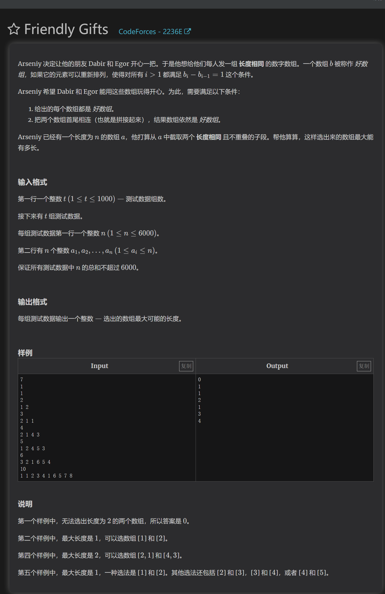
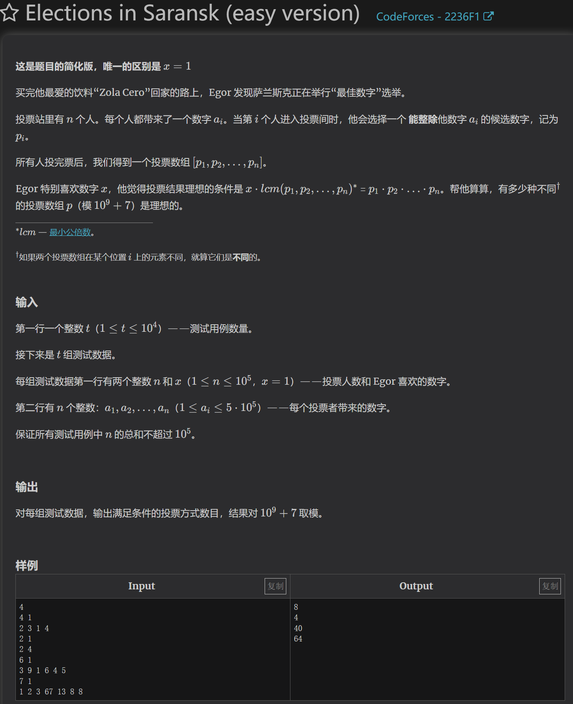

https://codeforces.com/contest/2236/problem/E

1.怎么n平方的复杂度找出所有元素连续的区间？
对应一串元素连续的区间，总有max-min+1==len区间长度，所以通过枚举右端点，更新max和min即可直接判断区间是否连续了

2.怎么直接找到两个长度相同但不重叠的区间？
对于两个长度且组合起来的区间，和不可组合的两个区间有直接区别，就是他们绝对不会重叠！

本体思路是先通过1求出所有区间，在发现2规律直接得到答案，当然三层循环暴力也过了。

https://codeforces.com/contest/2236/problem/F1

1.为什么lcm对应的gcd是两两互质
举例证明即可

2.计数规则的数学依据是啥
对于一个数，他能被一组唯一存在的质数表达式表示。
并且核心解题思路要求：每一个质数只能用来计算在一个数上。对于每个拥有质数x的数，一个数可以选择1-ni个x，另一个数可以选择1-nj个，所以两个数在只有一个数能够选择x的基础上，一共有ni+nj+1种做法（包括都不选）。对于另一个质数y的选择，两个质数选择是相互独立的，因为x*y也是约数，一个数可以分配任意个质因数。
那么结果就是每一种质数的选择方案数的累乘。

3.欧拉筛，同时该题快速获得一个数所有质数
欧拉筛就是用已经得到的质数，与当前i相乘得到以该质数为最小质因数的合数，进行标记。如果i的最小质因数等于质数x，即跳过。
本质是利用每一个数都有一个最小质因数，递推到的质数不是新数的最小质因数时跳过，以减少重复标记操作数。
-
该道题利用欧拉筛用最小质因数筛数的特性，直接将每个数的最小质因数保存，这样输入数x后，就能通过x和他当前的最小质因数一直逆推，快速得到一个数的所有质因数！

本体思路为数论，全在以上。