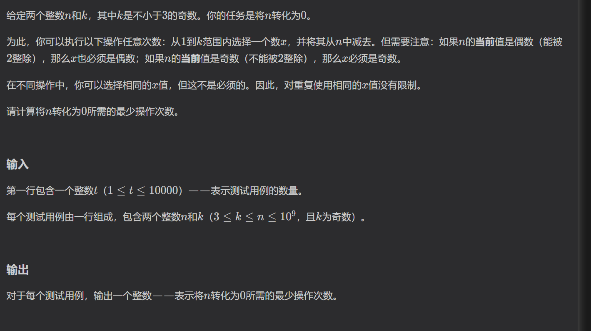
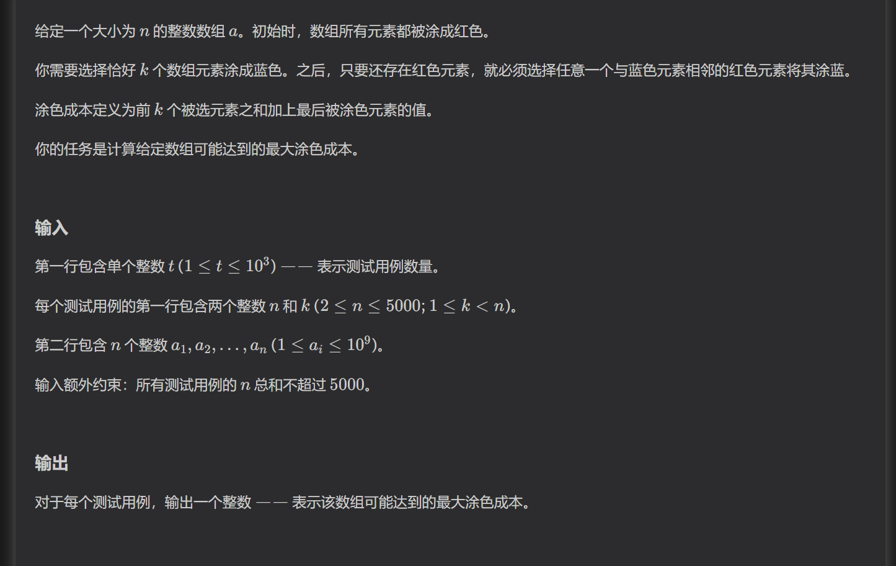
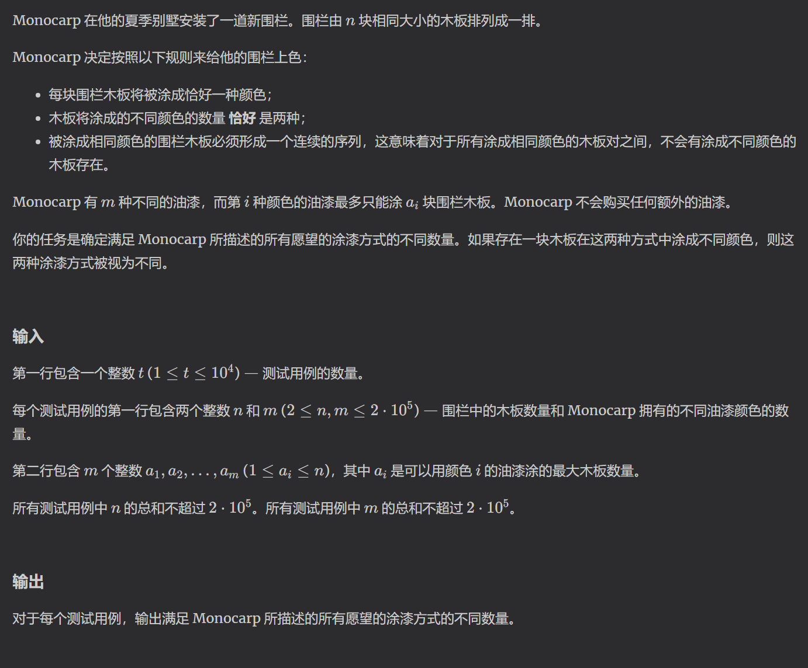

https://codeforces.com/problemset/problem/2075/A

模拟
模拟一下就可以发现，只有第一次可能会减奇数，剩下的次数必定全部是减去同一个偶数，然后减去非零余数

https://codeforces.com/contest/2075/problem/B

构造，贪心
题目条件要求构造一个序列，求序列价值与其能最后一个染色的价值和最大值
因为最后一个染色是根据我们自己构造的序列决定的，通过模拟，最后一个染色的元素左右必须有构造染色的元素。
既然是最大值，那么构造前k+1个最大值是最优的，而要构造出这个序列，我们可以假设可以涂k+1个格子，然后从中选一个左右都有染色的格子取消染色。
这样，我们就有一个必定为前k+1个最大值的序列。
但是当k=1时，我们是无法构造出一个左右都有染色的格子的，所以只能找到序列中的最大值，特判答案。

https://codeforces.com/problemset/problem/2075/C

构造
根据题意，我们首先可以想到枚举每中颜色，对每个颜色选取1-ai个情况下用二分计数，但是这样的复杂度是n*m*logn
那么我们可以转换一下思路，选择对涂颜色的木板数量进行枚举，使用二分枚举填在前面和填在后面的颜色数量，由于必须填两种颜色，所以要减去重复颜色，也就是min(l,r)

