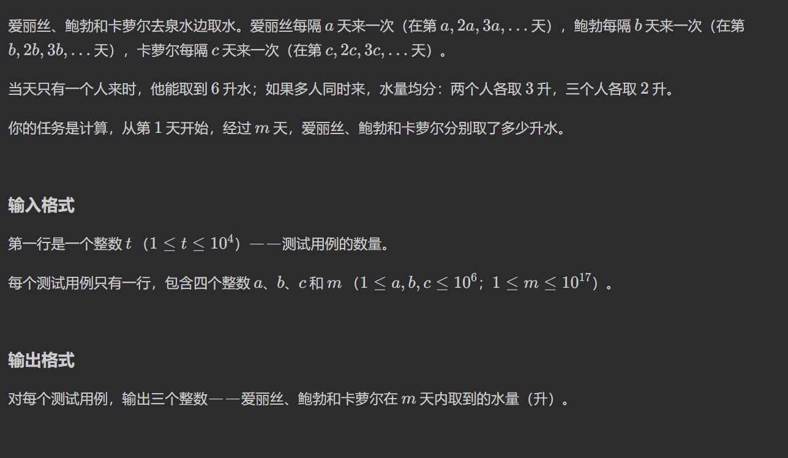
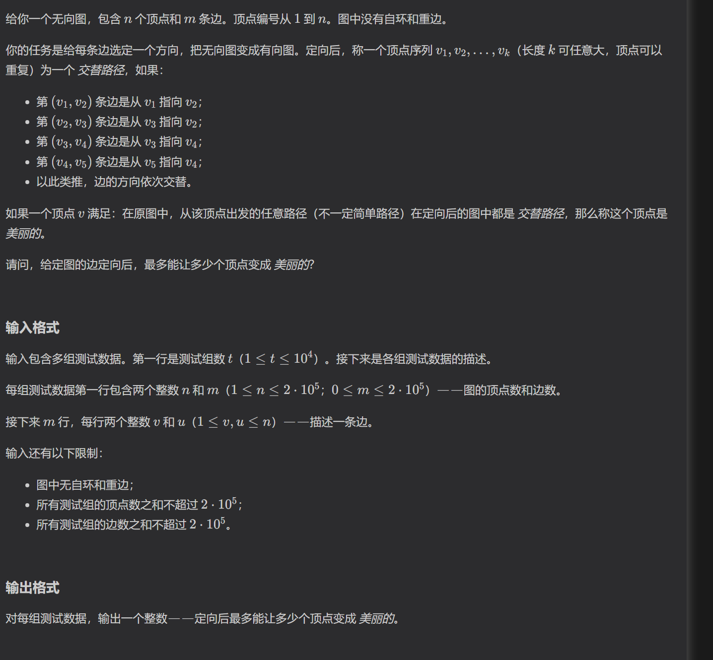
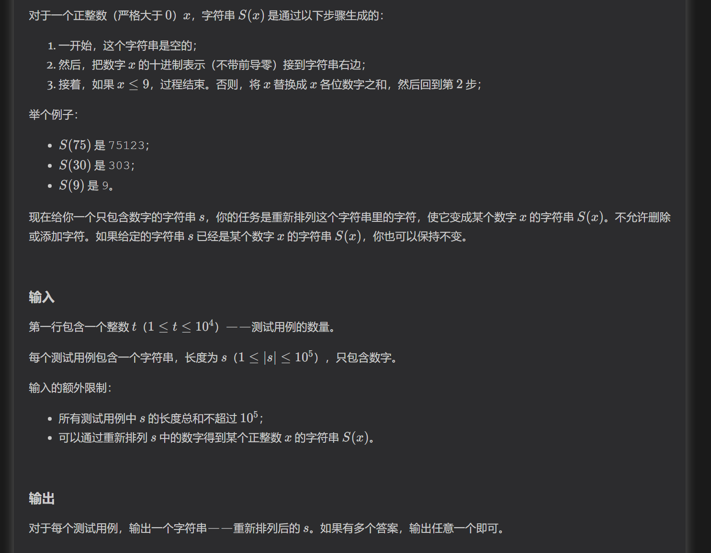

https://codeforces.com/contest/2204/problem/B
贪心，使用大根堆

https://codeforces.com/contest/2204/problem/C
数论，欧几里得定理

三个人中有多个人同时取水的天数，等于总天数中含有的最小公倍数

https://codeforces.com/contest/2204/problem/D
二分图

这道题关键是要先理解题意。
题目意思是美丽点必须满足：从这个点必须满足固定的交替顺序。
所以每个点可以分成两种状态：全部是出边和全部是入边
可以转化为计算奇数点和偶数点的个数，使用队列链接森林

https://codeforces.com/contest/2204/problem/E
贪心

这道题直接暴力是做不了的，所以要考虑某种优化或者减少计算次数。
题目将所有数位和加起来作为下一个数，那么整个数列加起来不超过9*n，
也就是说添加的第二个数大小不超过9*n，又因为知道一个数就能知道其后缀是什么，所以考虑枚举第二个数，
构造出整个字符串，判断是否为原串的重排列。

