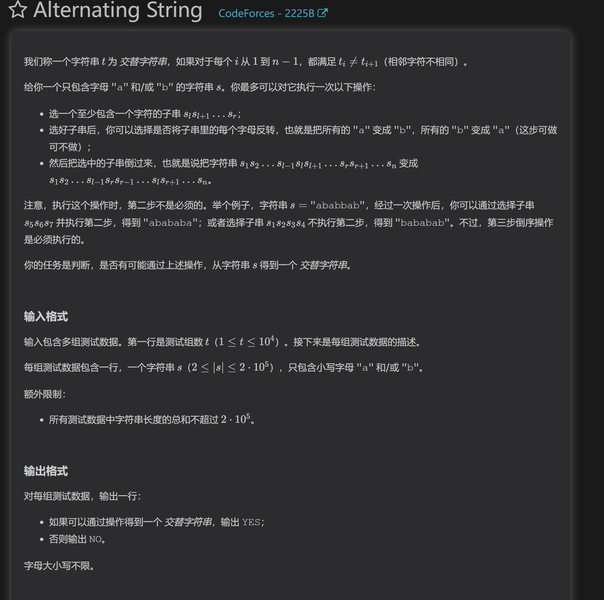
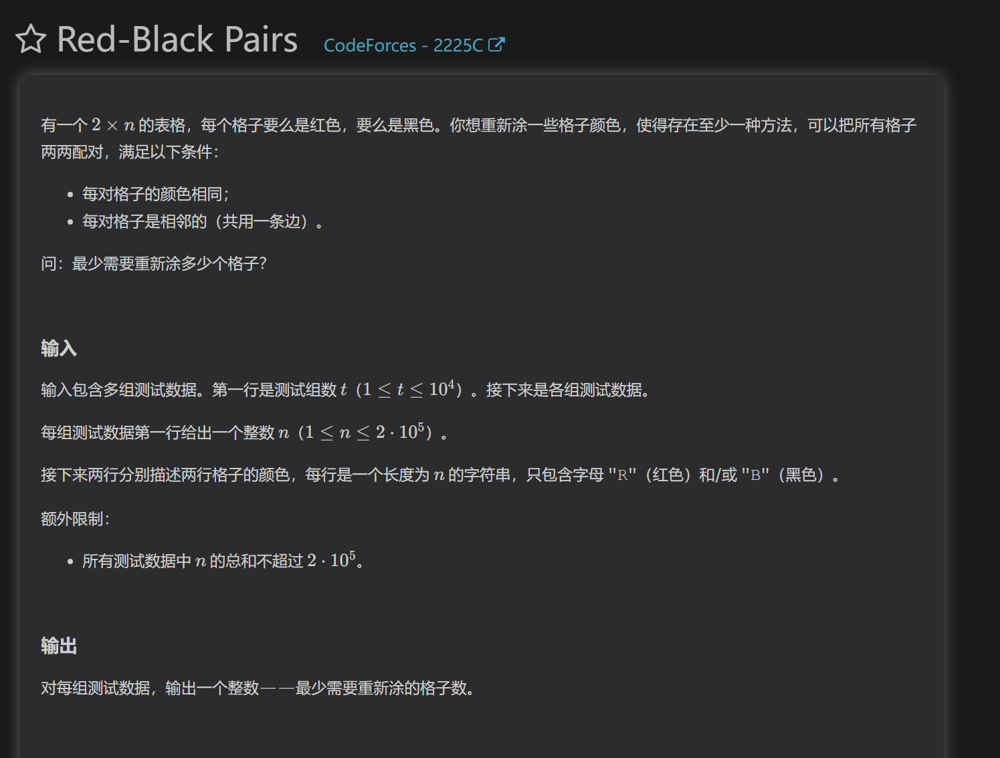

题
https://codeforces.com/contest/2225/problem/B

通过找这道题的操作限制，我们发现存在最多两处相同时，是可以输出“YES”的

https://codeforces.com/contest/2225/problem/C

这道题看着像二维dp，实则一维即可。
需要先分析每次操作，我们发现如果一个格子能直接向下匹配成功，那么可以直接匹配
如果不能，那么我们可以判断四个格子匹配需要多少花费。因为四个格子的花费可能小于直接两个格子匹配。
每次匹配完将四个格子修改。
实际上这是双指针做法

dp做法
两个状态：
从第i以前列匹配完成，第i列还未匹配
dp得到答案

由于“第i列还未匹配”实际上就是i-1的状态，所以可以压缩到一维，用i-2表示四个格子匹配
