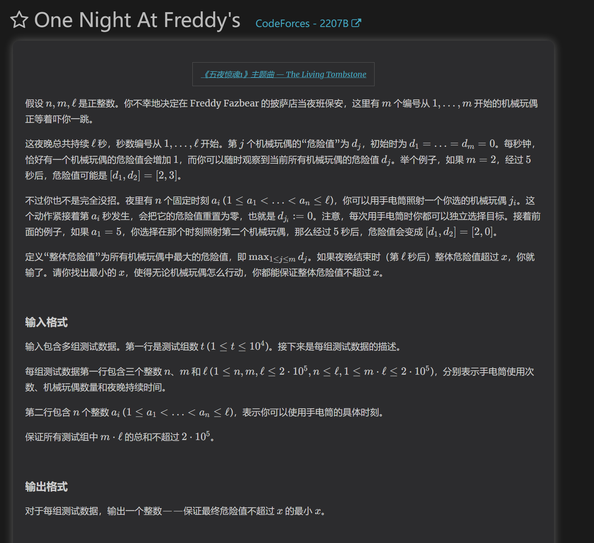
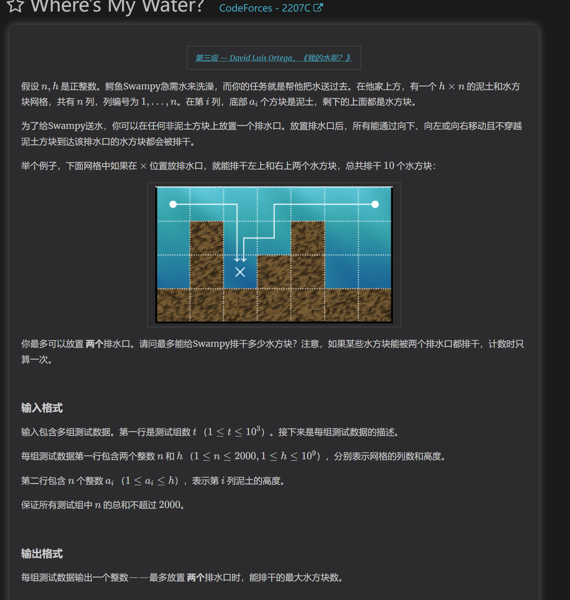

https://codeforces.com/problemset/problem/2207/A
贪心字符串
通过对操作构造数据可以发现，能进行操作的地方必定可以为0和1，同时也可以操作后，用更多的次数将其他位置的1转化为0
重点在于发现操作特殊性和最优解是什么

https://codeforces.com/contest/2207/problem/B

贪心，博弈论
要想得到整体最大的x，我们可以根据题意，把问题转化成：玩具熊如何增长，可以让每次被照射减少的危险值最小？
已知每次照射必定照射危险值最大的玩具熊，且已知照射次数
我们可以根据照射次数给玩具熊分配危险值，当照射次数还有x次时，我们给最多x个玩具熊分配危险值，每照射一次少分配一只玩具熊。
这样操作可以保证减少的危险值之和必定是最小的

证明：
如果维护多余x个小熊，那么照射减少的危险值之和肯定最小，但是单只有效的危险值可能更小，因为有非常多的危险值未浪费了
如果维护小于x个小熊，那么照射减少的危险值更多，所以最总答案可能更小
所以总是维护x个小熊，保证对于每次照射减少的危险值之和在全局最小，总是维护平均值保证每次减少的危险值尽量最小

https://codeforces.com/contest/2207/problem/C

