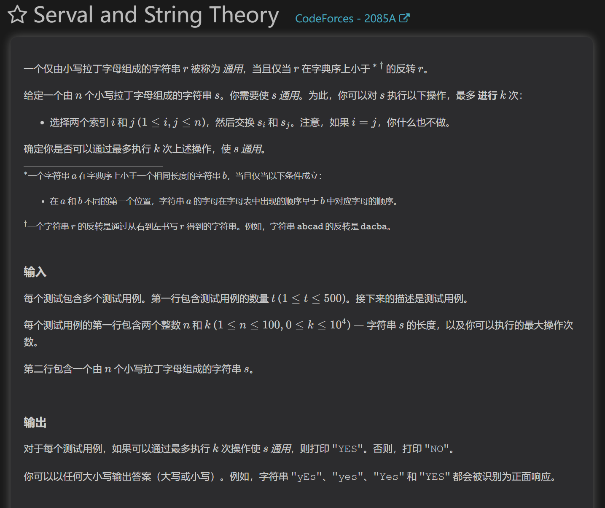
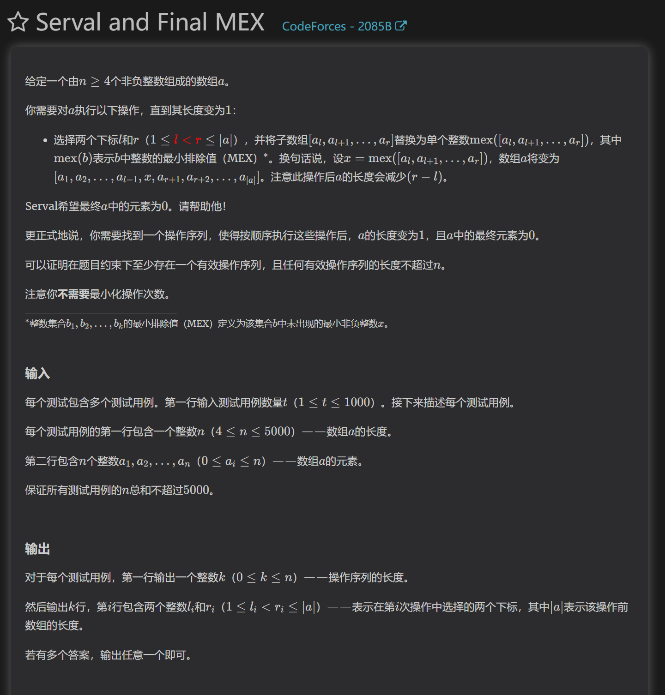
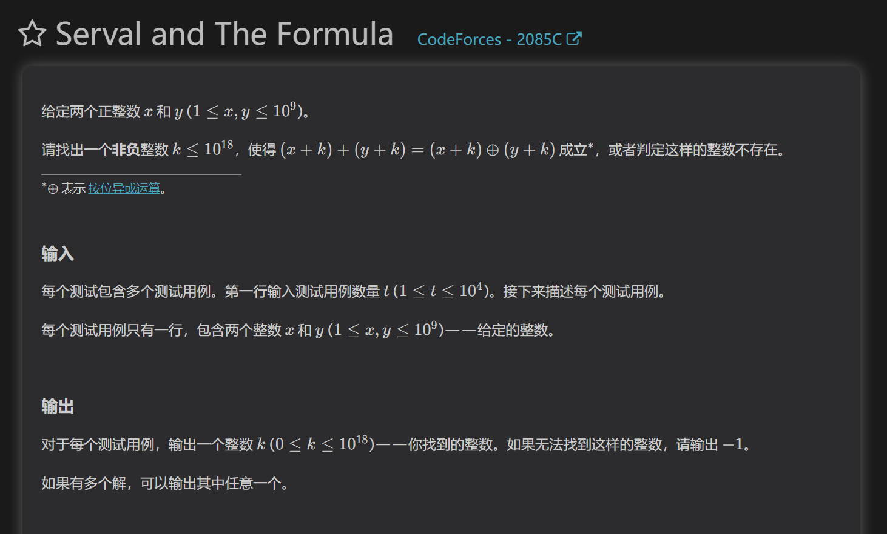
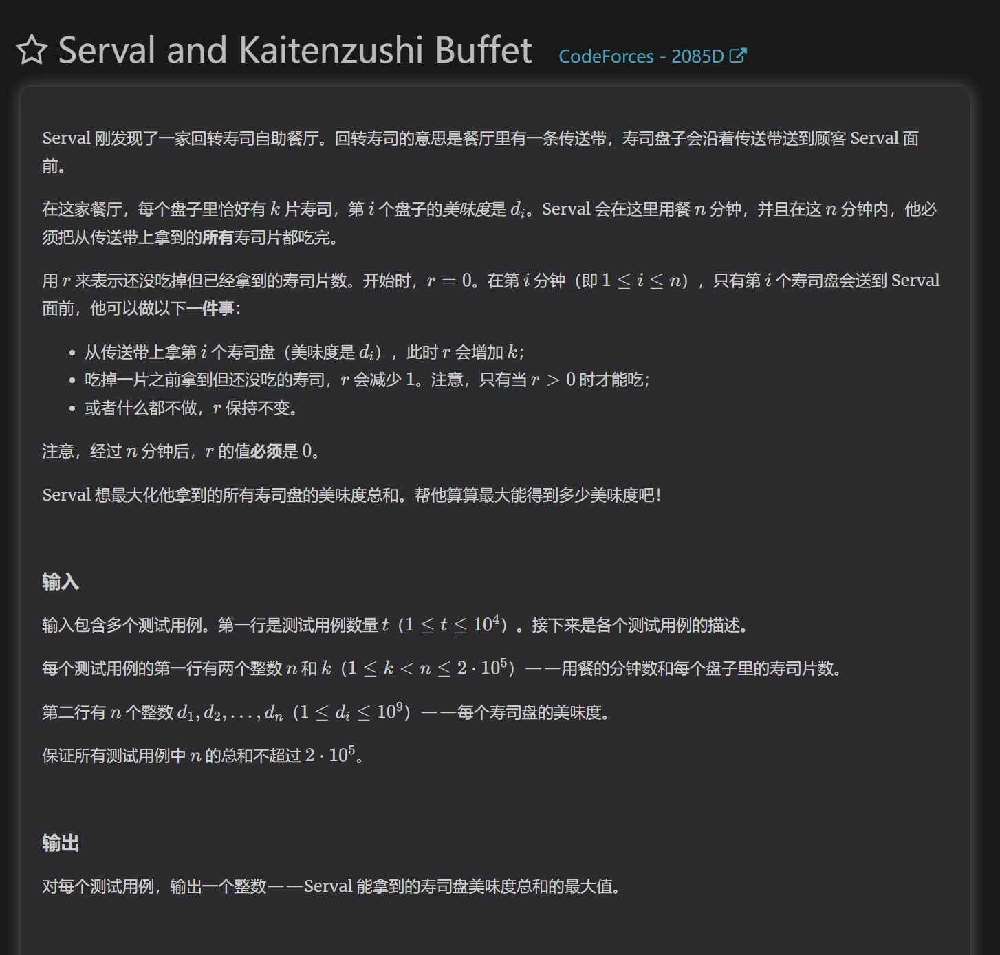

https://codeforces.com/problemset/problem/2085/A
暴力

构造小于r的字符串，首先反转，然后从首字母构造最小字符串，进行k次交换，然后判断能否得到答案即可

https://codeforces.com/contest/2085/problem/B
模拟

根据题意，我们需要将序列中的0全部通过操作消耗掉，对这个操作模拟即可

https://codeforces.com/contest/2085/problem/C

对题目的式子进行解析，能够知道要构造一个k，使x+k和y+k在二进制位上没有重复的1.
我们可以将x与y拆解出来一步步贪心构造
也可以根据二进制加法，用一个非常大且只有一位1的二进制位的z数，减去max(x,y)当作k，此时k+max(x,y)一定是等于z的,他对小于他的数异或都不会产生进位，而min(x,y)+k绝对不会大于z，所以可以证明这个数可以，如果x==y，则必定无法构造出k

https://codeforces.com/contest/2085/problem/D

因为时间是有限的，我们最多做（n/k）次拿寿司,所以一盘寿司的花费可以看作(k+1)，每次到(n-i)%(k+1)==0时，我们可以拿一盘价值最大的寿司，这份价值最大的寿司可以用堆维护
因为每盘寿司需要花费时间去吃，所以我们必须对每盘寿司留出k的时间去吃，所以我们可以限制“什么时候必须拿一盘”，这样来约束吃寿司花费的时间。
最终可以获得模型：在时间轴上，从左往右扫描，每到某些截至点，必须选择一个之前的元素。带截至时间的最大权选择问题

模型关键词：
    每个选择消耗固定资源（k）
    总资源有限（时间）
    每分钟只能做1操作
    必须完全消耗（r=0
转化为：
    选择数量受限 + 每个选择有 deadline