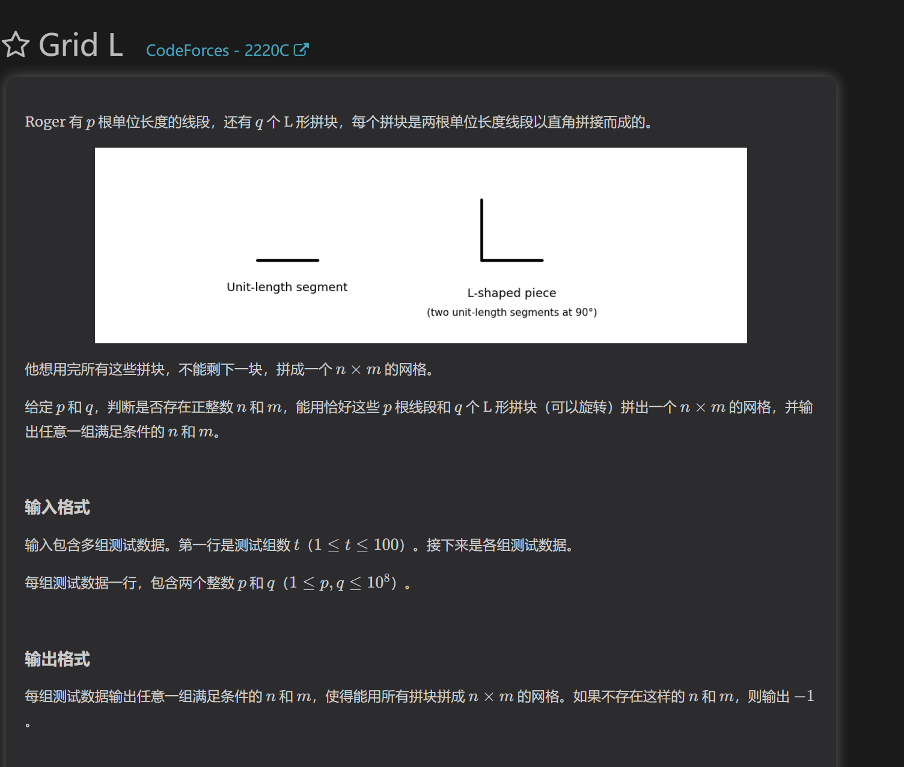

https://codeforces.com/contest/2220/problem/B

本题关键是明白hecter的必胜态必须是没有一段连续相等的串长度大于等于x

https://codeforces.com/contest/2220/problem/C

本体解题角度对解决证明题很有帮助

首先对两种方式模拟发现，短线段可以合成长线段，所以我们需要尽可能多的用折角长线段。继续模拟，我们发现了如下规律：
对于构造，最优的选择是先用长和短线段合成n*n的矩形（因为其可以只用长线段合成）
接下来每添加一列，都最少使用一根短线段即可。
所以我们得出最优的构建方案。但是此时不好写出实现代码。

这使我们将问题抽象成公式：
对于每一个矩形，都有p+2* q=sumL=(n+1)* m+(m+1)*n;
整理出m=(p+2* q-n)/(2*n+1)。
所以我们枚举长度n，判断是否满足n能构建出另一个m，同时判断p是否能构建出abs(n-m)列