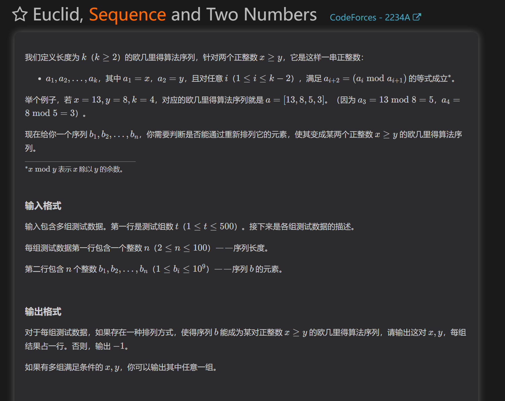
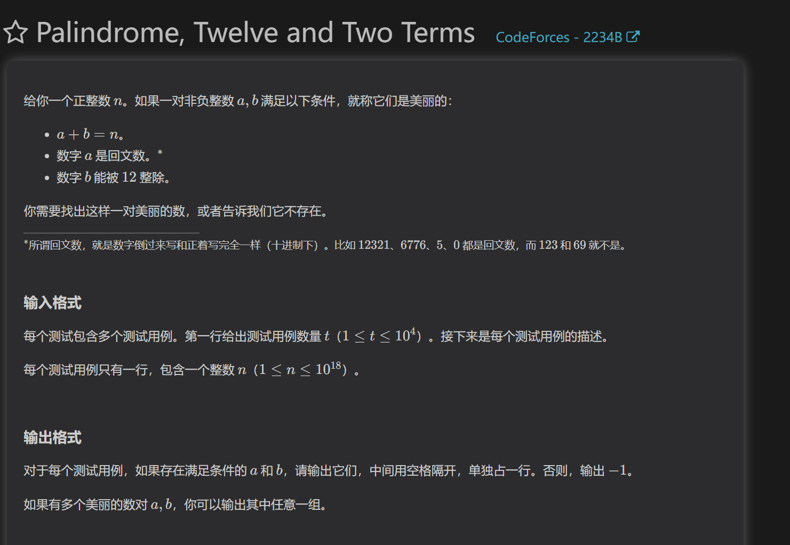
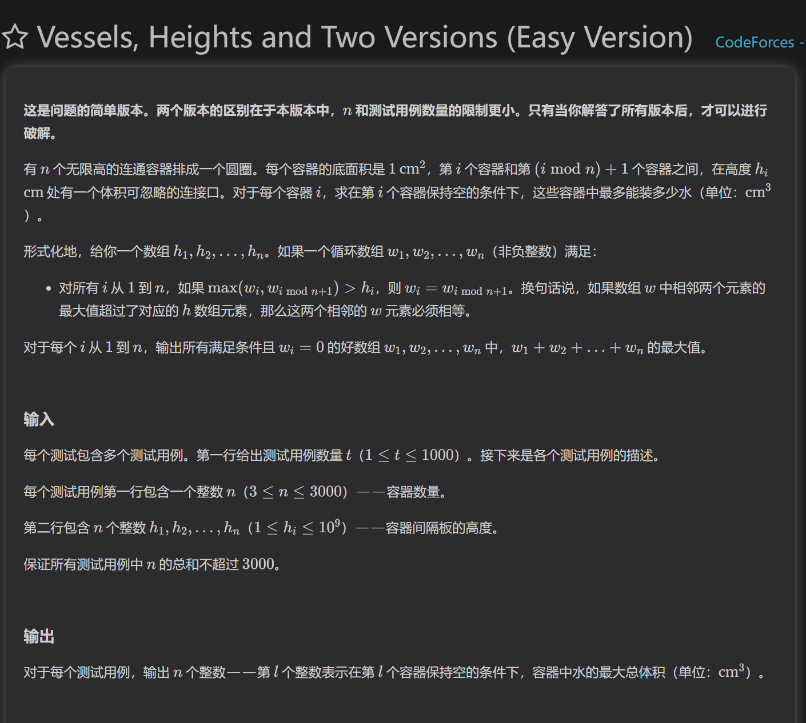
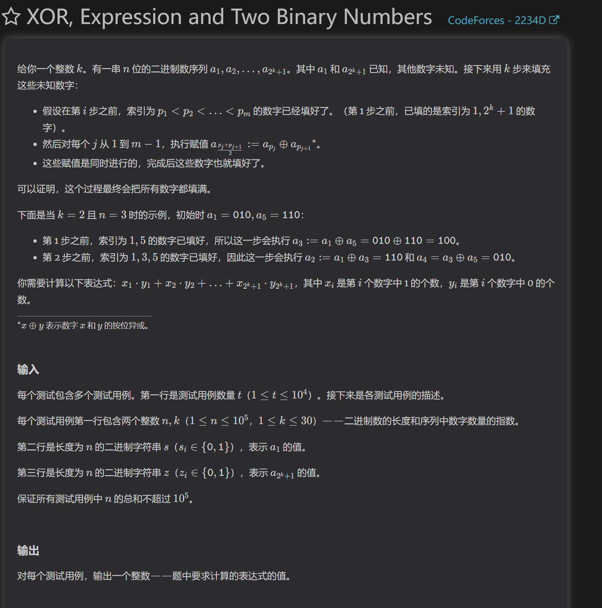

https://codeforces.com/contest/2234/problem/A
A题

A题赛时曾wa一发，纯纯公式每推完就写

B题

12的余数有0-11，也就是说对每个余数，我们都能找到一个与之可构建成最小回文数，且为十二的倍数，也就是对每个余数最小的答案。

C题

对于成环的这一组连通器，我们装水必须保证当前容器高度向左不能超过左方区间的最大值，向右不能超过向右区间的的最大值，答案为两者的min。
这种环模型，会向两边填充->遇到大于其的高度即停下->只要没有到达边界，任何最大值都是允许的->最终答案取左右两边的min

D题

首先我们能找到规律：无论怎么填充，由于异或的性质，填充的数字只有a，b，a^b。
然后再找到规律：三个数总是三个一组出现，当出现三的余数时，表示多出了一个a和b