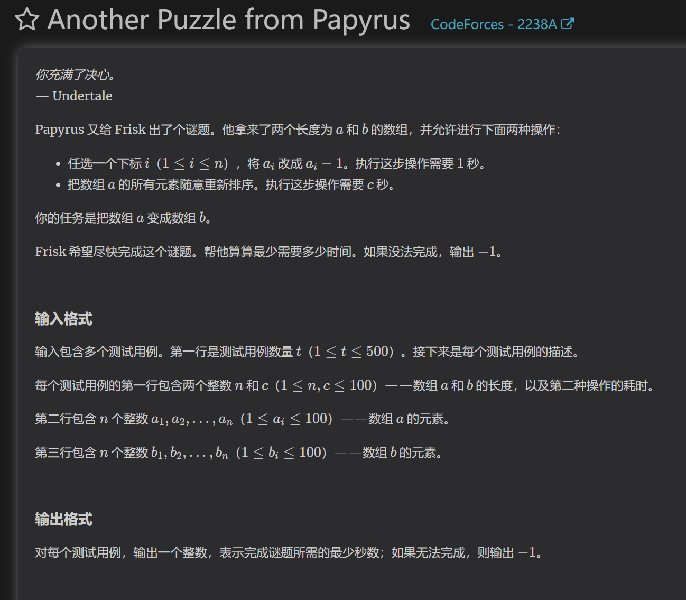
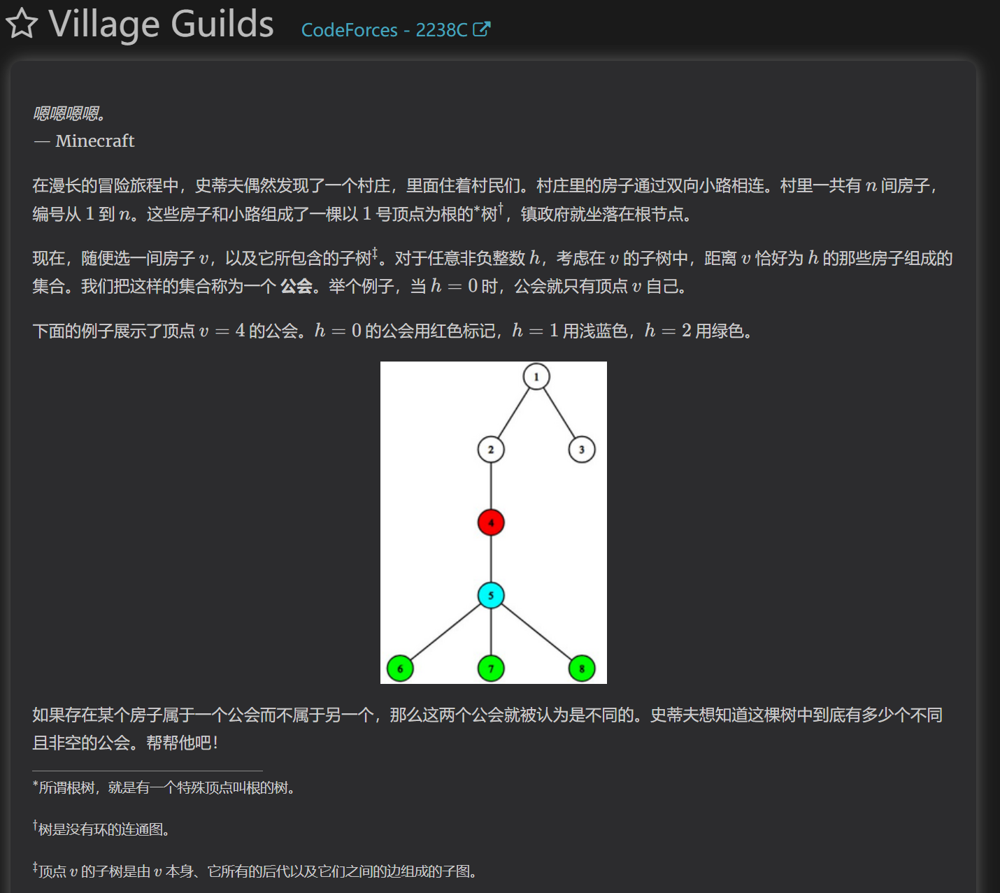
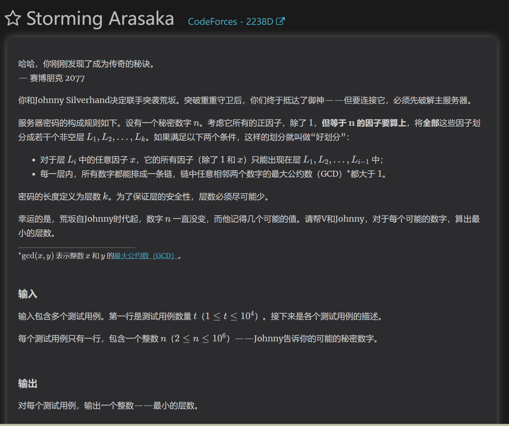
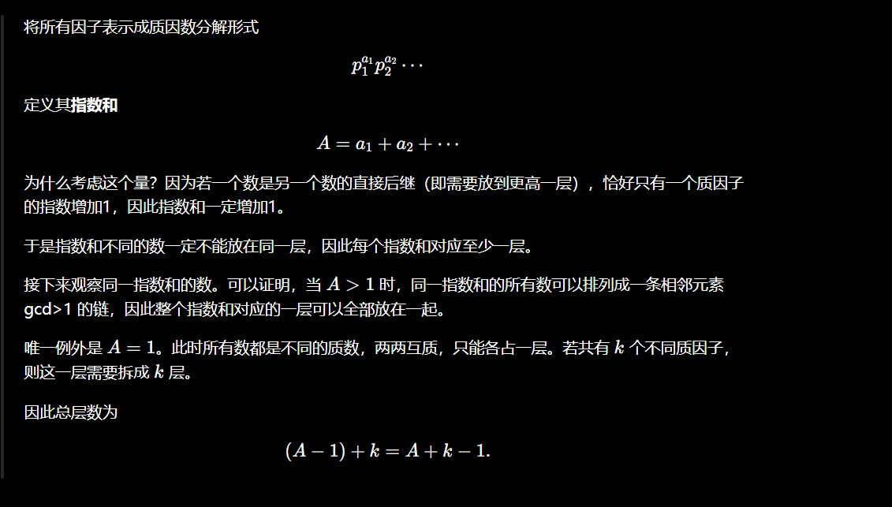

##A

首先根据数组和的关系，我们能知道无论怎么排序，最终a变b所需要进行的操作1总数不变。所以可以计算出排好序后a变b的时间，在判断是否需要排序。排序后的任意a如果小于b，则不能变成a。

##B
数可以拆分成多个唯一的质因数。所以a和b的公因数也是由多组质因数构成的。
那么公式就可以变成
min( max(vp(a),vp(b)) , max(vp(b),vp(c)) )=gcd(lcm(a,b),lcm(b,c))
（gcd求两个数均拥有的每种质因数的最小个数，lcm求两个数均拥有的每种质因数的最大个数）

那么当gcd取lcm(a,b)时，vp(b)<=vp(a),同时vp(c)。同理得取c的情况。最终条件变为b必须为a和c的约数。枚举b的倍数即可，及（n/b）

##C

相当屎的题面，意思就是对于每个点v的子树，距离v恰好为H点店构成一个集合，求所有点构成的集合的种类数。
//对于每个点，只要有多个子节点，那么就可以继承层数第二大节点的子树的大小。
对每个点，除了 {v} 一定贡献一个新集合外，只有当某一层在至少两个儿子的子树中都有节点时，才会产生新的集合。因此该点额外贡献的数量等于所有儿子向下深度中的第二大值。

##D

我们将所有数以质因数的形式表示，得到p1^n1 * p2^n2...的形式。记n1+n2...的和为A，只要任何一个质因数的指数+1，这个新数就会变成原数的倍数，也就是必须划分到新的一层。（任何覆盖关系（cover relation）都会使指数和增加1。于是得到：指数和不同的数一定不能放同一层。）
所以我们得到一个结论就是A和A+1必须划分成不同层数的数。注意到只要A>1，那么A大小相同的数必然能组成一个相邻两个数最大公约数大于1的链，所以我们能得到，A>1的数，都能划分到同一层，A==1的数只能单独一层。（对于任意倍数关系，指数和严格增加，因此不同指数和一定属于不同层。）
（固定指数和后，可以不断把一个质因子的指数向另一个质因子"转移"，每一步都保持至少有一个公共质因子，因此可以构造一条经过所有状态的链。）

所以我们先求出n有k个质因数，所有质因数的指数和为A，A减去A==1的情况，得到答案为k+A-1

解题思路可以这么想：
由于倍数关系对应着某些指数增加，

于是寻找一个能衡量"增加了多少"的量。

最自然的就是

所有指数之和。

因为每次只增加一个指数，

所以这个值一定增加1。

于是它天然就是层数的下界。

【题目】

【突破口】★★★★★
（一句话说明第一眼应该观察什么。）

【关键观察】
（1~3条，每条一句。）

【推出的性质】
（每条一句。）

【特殊情况】
（所有需要单独讨论的情况。）

【最终结论】
（公式或算法。）

【为什么能想到？】
（以后遇到什么特征，就应该想到这种方法。）