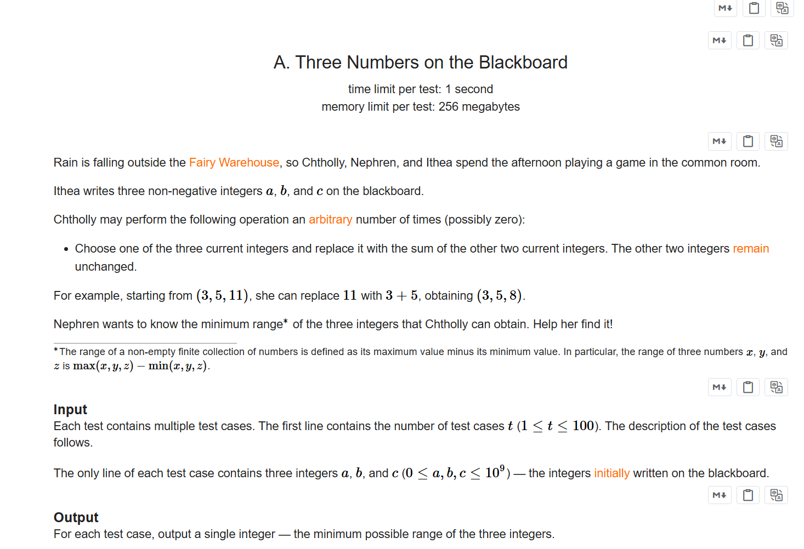
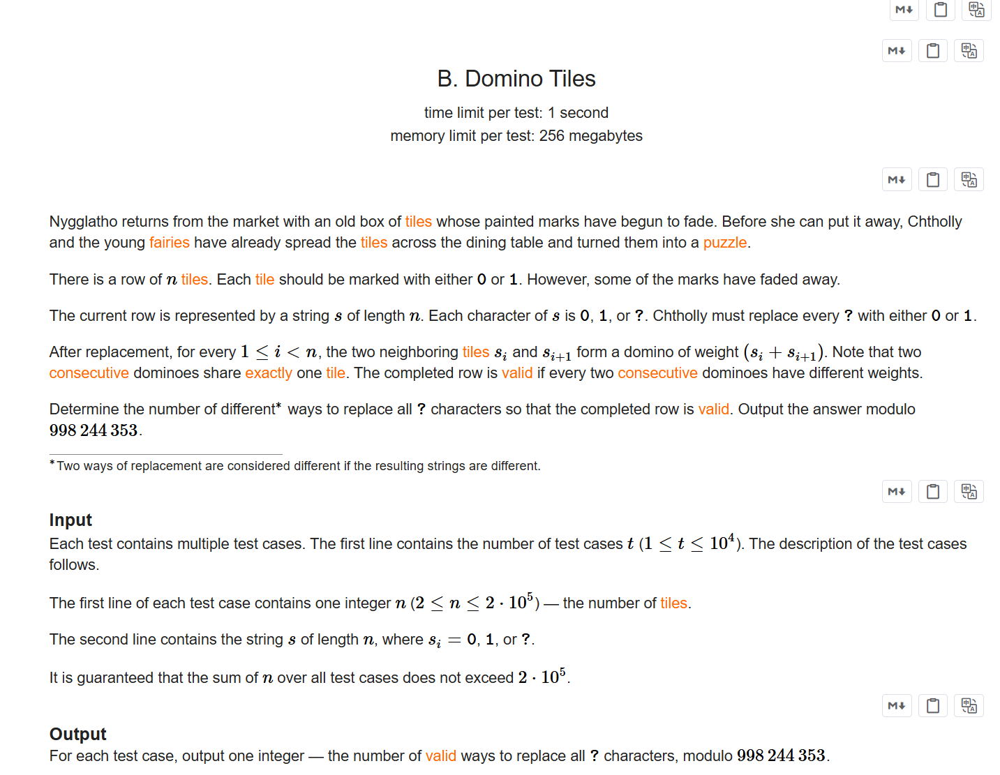
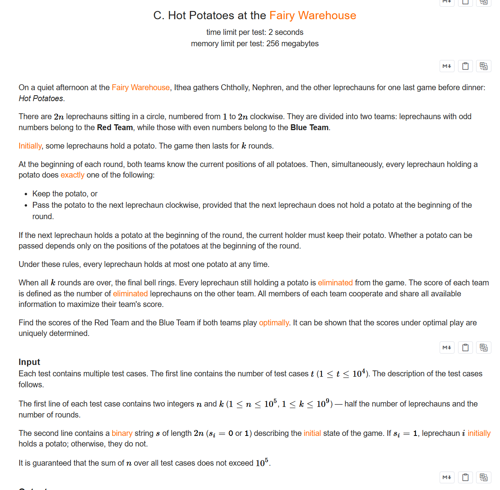
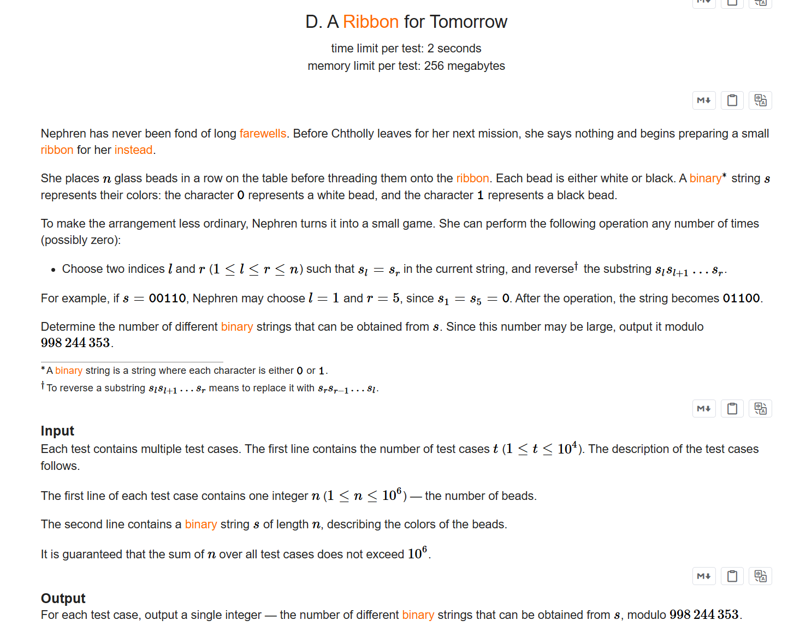

+++
title = 'Div2 1116'
date = '2026-08-18T10:52:15+08:00'
draft = false

tags = ['无']
categories = ['博客']

author = 'Luo Hong'

showReadingTime = true
showTableOfContents = true
showWordCount = true
+++
# div2 1116
## A

题意：
三个小人玩游戏，给你三个数，你可以进行任意次如下操作：

- 选择两个数，将两个数的和替换第三个数。

现在求你可以得到一系列的三个数，其中最大的数减最小的数得到的数最小是多少？

---
我们可以通过这样的操作，把题目条件变成：任意两个数及其和的组合，{x，y，z}的组合，求这些组合的结果最小值

## B

题意：
小人和仙女玩游戏，给一个0，1，？构成的字符串，我们需要将？替换成0或者1，最终字符串的任意两个相邻字符si+si+1必须与si-1+si不同。

---
无论怎么填？，都可以先当前位置前面的所有？都填好，然后根据之前的结果决定当前？应该填什么。这说明状态可以转移，所以使用动态规划即可。设计状态dp[2]:

- 下标0：前一个数选择填0，有多少种字符串
- 下标1：前一个数选择填1，有多少种字符串

## C

题意：
三个小人在仙女房内玩游戏，给定一个用0和1分组的01字符串，有些位置上有标记，问进行k轮传递标记的博弈后，0和1哪一边得到的标记更少

---
模拟样例后发现，当标记始终握在自己手中时，收益一定是最大的，只需要在最后一轮中尝试将标记传递给下一个数即可。所以题目给定k没有用，直接模拟最后一轮的传递计算答案即可。

## D

题意：
Nephren不喜欢分别，他为即将离别的朋友编制一条特殊的围巾。给定一个01字符串，N可以选择任意串上任意两个元素相等的位置，反转这两个位置之间的字串，求最终能得到多少个不同的字符串。

---
把连续重复出现的0和1分组，交换操作选择子串两端s[l]，s[r]的元素种类必须相同，那么不属于l,r所属的组的其他元素，他们的组的长度不会改变。l,r所属的组，他们的长度因为选择两端的位置，发生长度的改变，数量的改变就产生了新的字符串种类。
那么题意就可以转化成，分别处理0和1的组，计算可以通过隔板法，得到多少种不同的组合，最终答案为0和1的组合数乘积。