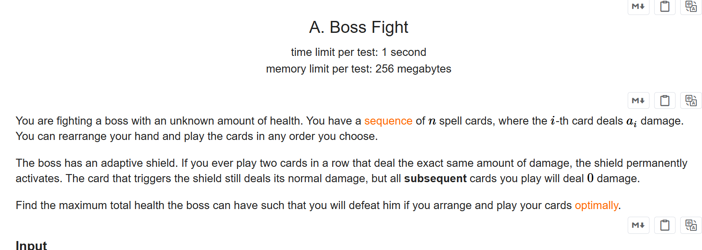
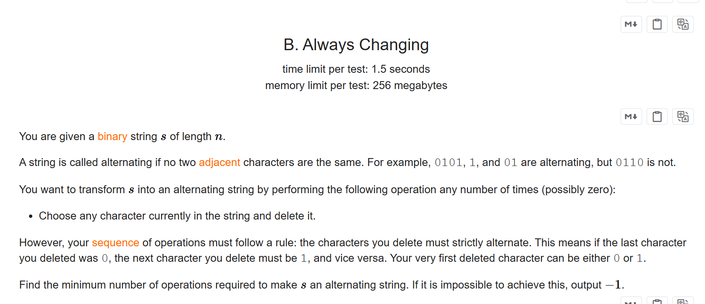
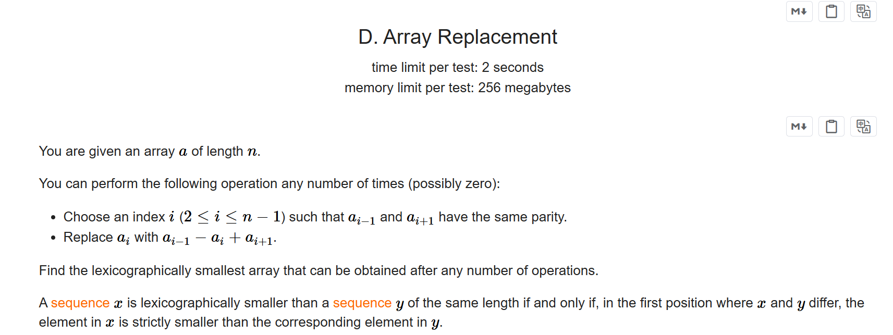
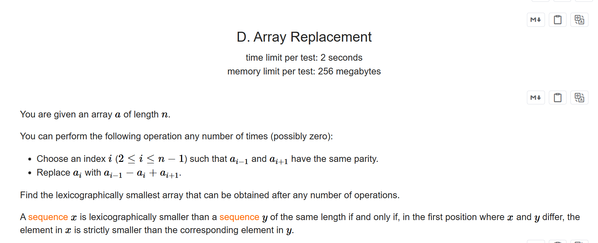

+++
title = 'Div2_1115'
date = '2026-09-01T17:05:40+08:00'
draft = false

tags = ['Codeforces']
categories = ['题解']

author = 'Luo Hong'

showReadingTime = true
showTableOfContents = true
showWordCount = true
+++

## A

连续使用两张相同的牌时，将不能再造成伤害，所以我们要尽量这样的结果

当有一张牌的数量比剩余牌数量多2时，将必定会发生后续无法伤害的情况，再次之前我们能将其他牌全部用完。

所以分类讨论，当出现上述情况时，答案为除最多数量卡牌的价值和，加上（剩余卡牌+2）*$a{/text{数量最多的那个卡牌}}$
## B

手玩一下，发现当0和1必须删除的数量查小于等于2时，必然可以成功，其他情况只能输出-1，所以分类讨论。

情况只有三种，自行模拟一下就知道了
## C

直接暴力是不行的，结论也是没有的，所以我们需要有个贪心的模拟

考虑用小根堆来维护：小根堆中存当前选择移去的num个方块的价值，设sum为小根堆里num个移去方块的价值和。

我们从最底层开始维护，每层都只判断sum能不能让该层稳定度不够，使高楼倒塌。如果sum>=$v_i$，让堆弹出直到sum<$v_i$，同时num=堆.size()

因为要求最小的移去数量，所以num只减不增。初始num=m，始终保持堆的大小不大于num，最终答案为num。
## D

本题使用到交换差分

设$d_i$=$a_i-a_{i-1}$，那么有$d_{i+1}=a_{i+1}-a_i$

通过操作$a_i'=a_{i-1}-a_i+a_{i+1}$，我们能得到：$a_i'=d_{i+1}+a_{i-1}$，将$a_{i}'$带入$d_{i}'$，得到$d_i'=a_{i+1}-a_{i}$。

因为$a_i$改变了，所以$d_{i+1}$相应改变，有$d_{i+1}'=a_{i+1}-a_i'=a_{i+1}-d_{i+1}-a_{i-1}$==>$d_{i+1}'=a_i-a_{i-1}$，因为$a_{i+1}$未改变，所以$d_{i+2}$仍等于$a_{i+2}-a_{i+1}$。

所以，操作$a_i=a_{i-1}-a_i+a_{i+1}$本质上使交换了$d_i$和$d_{i+1}$的值。因为操作要求$a_{i-1}$和$a_{i+1}$的奇偶性一至，所以这个操作在$d_{i}mod2==d_{i+1}mod2$的连续子序列里有效。

最终我们能得到**这道题的解题思路**：得到d数组，然后将连续且$d_{i}mod2==d_{i+1}mod2$的序列看作一组，将每组从小到大排序，最后通过$d_1=a_1$，累加d数组得到最小字典序数组。