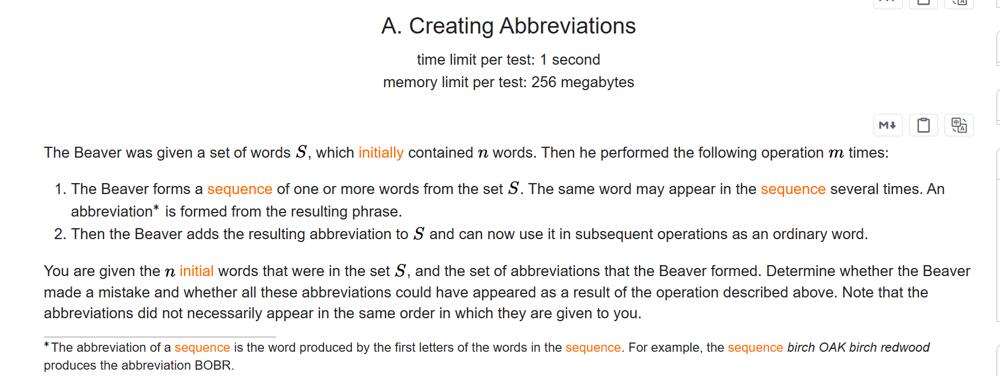
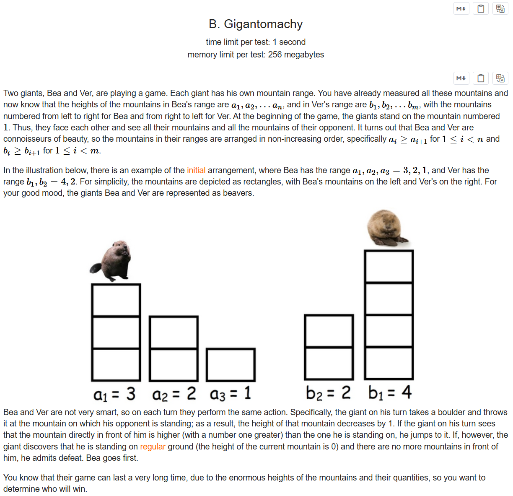
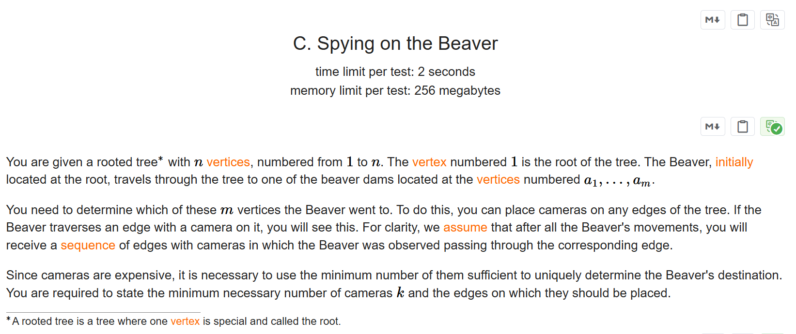
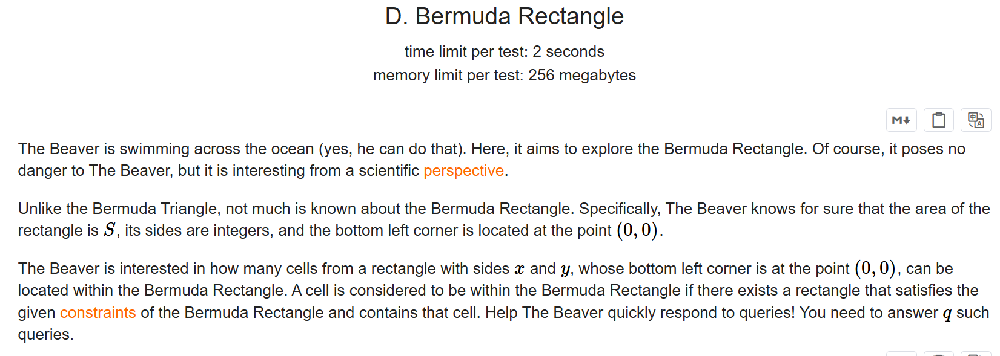
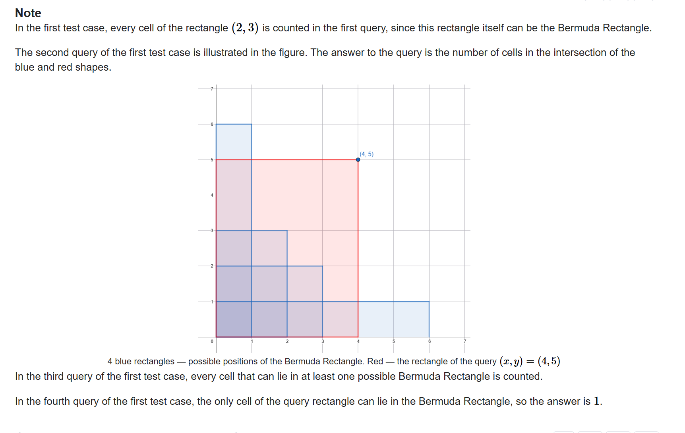
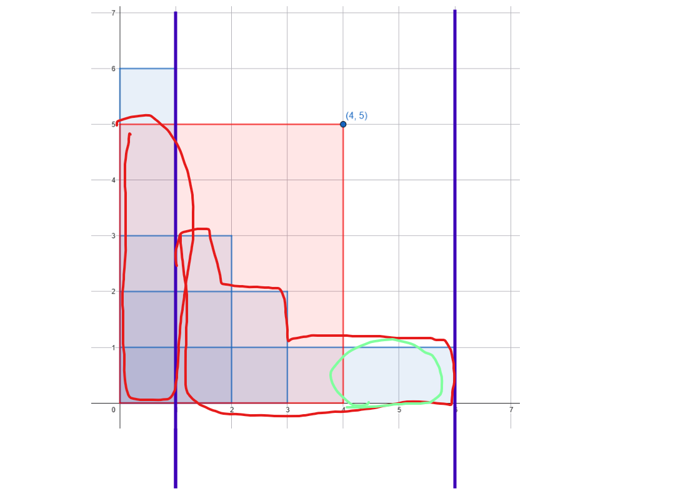

+++
title = 'Div2_1117'
date = '2026-09-01T14:04:38+08:00'
draft = false

tags = ['Codeforces']
categories = ['题解']

author = 'Luo Hong'

showReadingTime = true
showTableOfContents = true
showWordCount = true
+++
## A

通过记录每个单词的首字母是否存在，直接对每个字符串按要求判断即可。

## B

两只小河狸的到达地面所需要的石头个数是固定的，所以分别算出所需石头数量然后比较大小即可。

## C

手玩一下，发现如果一个目标节点存在一个祖先也是目标节点，那么就必须设置一个摄像头在最近的这样的祖先和该点之间。但是根节点必须特判，如果根节点不是目标节点，那么可以少安装一个摄像头.
简单来说，就是每个目标节点必须有摄像头，答案为m，如果根节点不是目标节点，那么答案为m-1.

## D

研究题目给出的样例图片我们能知道：
- 可能出现的正方形，是在以S的两个因数为边长的矩形内。

所以求得所有矩形后，y轴的变化在x轴是单调已知的，而要求在x和y这样一个矩形范围内满足条件的正方形个数，那我们就可以二分查找**高度超过y的x轴位置**和**刚好大于等于x的x轴位置**，在下图用紫色垂线表示位置。

那么答案就是两个红色区域之和，再减去绿色区域。预处理正方形数量的前缀加速运算。