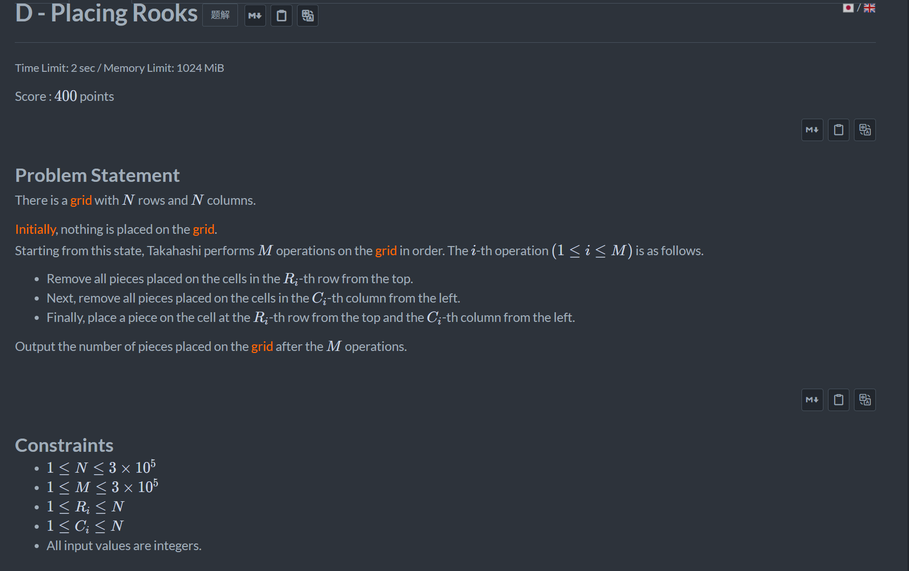
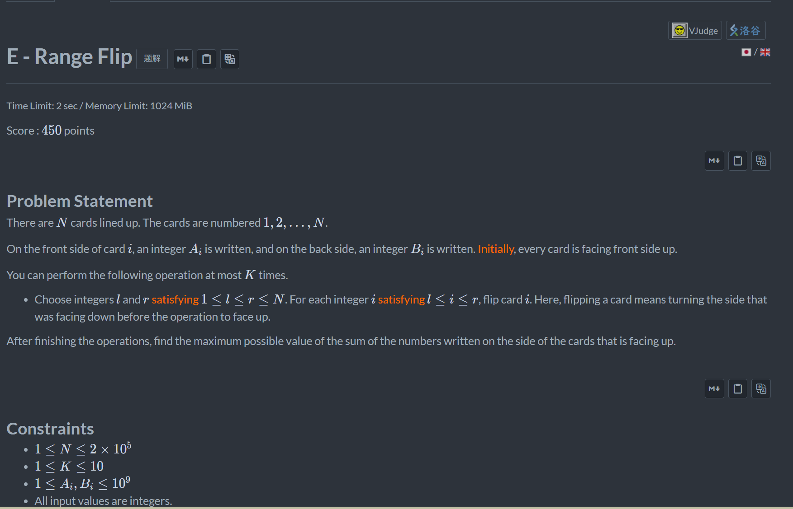

+++
title = 'Abc_466'
date = '2026-08-19T21:57:36+08:00'
draft = false

tags = ['abc']
categories = ['题解']

author = 'Luo Hong'

showReadingTime = true
showTableOfContents = true
showWordCount = true
+++

## D

由于要求操作完M次后的结果，首先考虑模拟。由于操作得知，每一行每一列只能有一个棋子。所以设置两个数组x[]，y[]分别表示第x行和第y列对应的y[]和x[]是什么。每次更新会把第x行和第y行对应的数全部拿掉，对应的只最多就是两个数(x[i],y[x[i]])，(x[y[i]],y[i])，把他们的x和y全部置零，并将最新的数填进去即可。

## E

注意到翻动的次数k最大为10次，所以可以考虑dp。
设计状态dp[i][j][1/0]，表示第i位，已经翻动j次，并处在翻动/未翻动（1/0）的状态下的最大和。转移方程如下：
- dp[i][j][1]=max(dp[i-1][j-1][0],dp[i-1][j][1])+b[i]
- dp[i][j][0]=max(dp[i-1][j][0],dp[i-1][j][1],dp[i])+a[i]
> 必须有翻动/未翻动的状态，只有两维无法判断第j-1次应该是次数+1还是保留