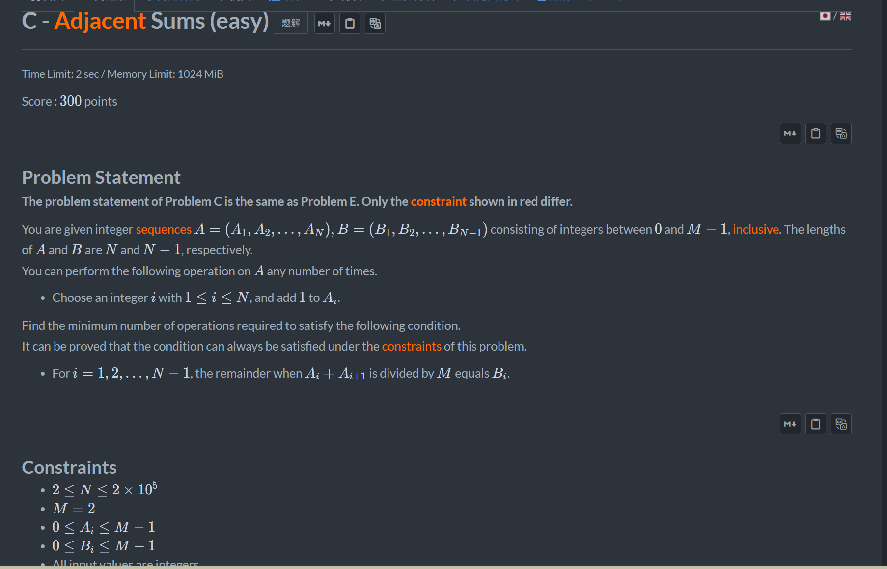
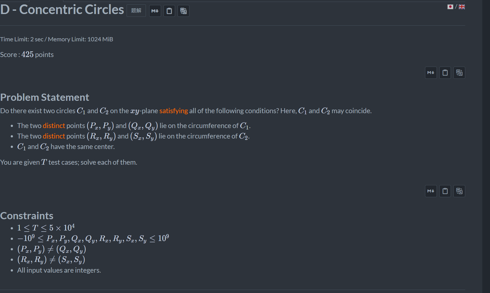

+++
title = 'Abc_467'
date = '2026-08-19T22:25:25+08:00'
draft = false

tags = ['abc']
categories = ['题解']

author = 'Luo Hong'

showReadingTime = true
showTableOfContents = true
showWordCount = true
+++

## C

由于M等于2，所以a%M的值不是1就是0。再发现，确定a首个元素的大小，那么整个a序列所有的元素大小都能确定了，对a[0]=1和0的情况计算答案并比较即可。

## D

运用圆的性质可以发现，只要两条线段中点上的垂线平行，就必然无法构成两个同心圆。判断是否平行只需判断两线段的k值大小是否相等，一个线段的中点到另一个线段两端长度是否相等（判断平行条件下两垂线是否重合）
> 比较两个k的大小时，需要注意k是否垂直x轴，我们可以运用等式减少除法运算,将k的比较转化为(x1-x2)(y3-y4)?=(x3-x4)(y1-y2).

## E
