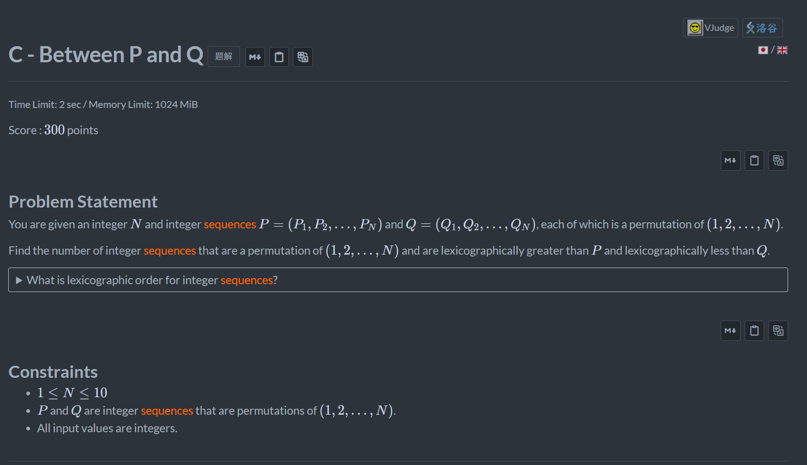
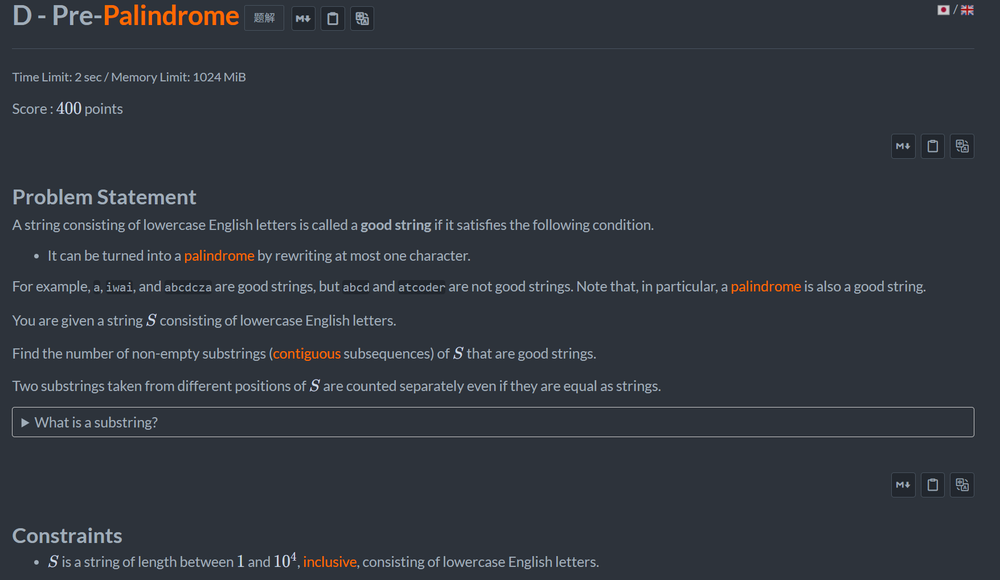
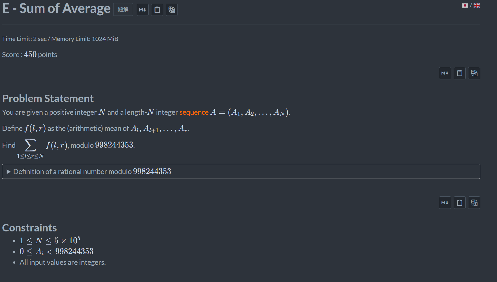

+++
title = 'Abc_468'
date = '2026-08-22T15:52:28+08:00'
draft = false

tags = ['abc']
categories = ['题解']

author = 'Luo Hong'

showReadingTime = true
showTableOfContents = true
showWordCount = true
+++

## C

c++函数next_permutation能够直接找到当前序列字典序的下一个序列。直接使用这个函数即可

## D

题目给出的数据范围在1e4，可以直接考虑区间dp。
设计dp[i][j]，表示下标i-j的字符串为1(不修改字母就是是回文串)，2(修改一个字母后变成回文串)，0(无法变成回文串)。状态转移如下：
- if(dp[i+1][j-1]==2&&s[i]==s[j])dp[i][j]=2;
- if(dp[i+1][j-1]==1&&s[i]!=s[j])dp[i][j]=2;
- if(dp[i+1][j-1]==1&&s[i]==s[j])dp[i][j]=1;
> 我写的不优雅，再增加一维表示0-2的状态就能避免大量if判断的情况了

## E

需要将计算公式整理，然后可以发现能通过预处理和dp降低复杂度。
详情可以看链接<a>https://www.luogu.com.cn/problem/solution/AT_abc468_e</a>