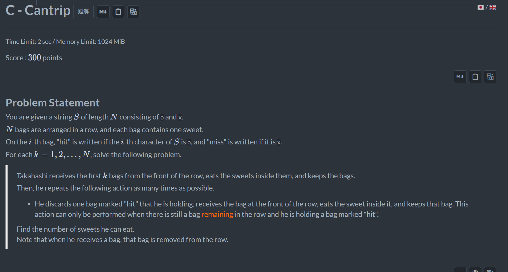
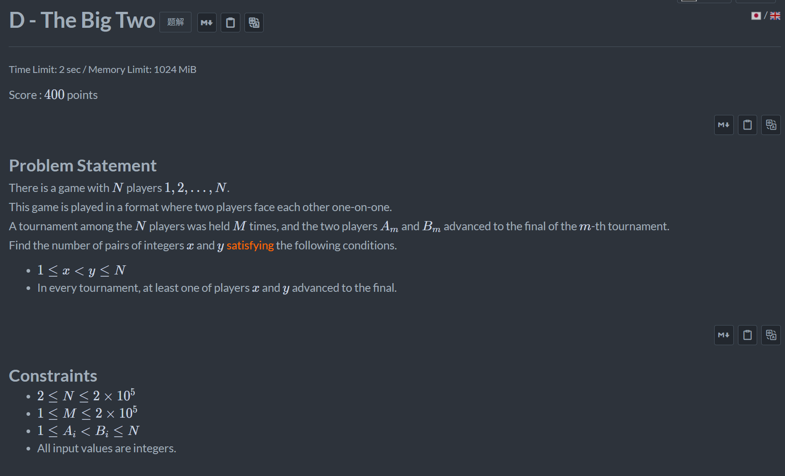
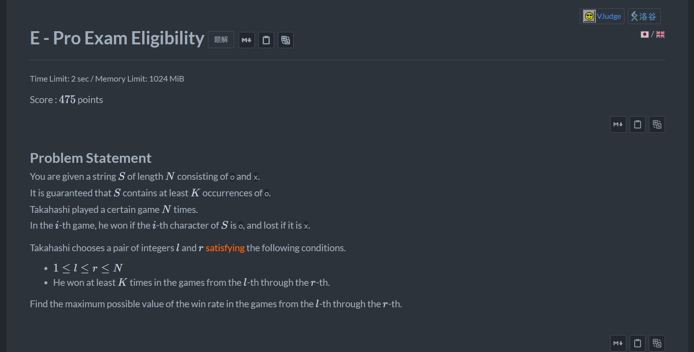

+++
title = 'Abc_469'
date = '2026-08-27T10:15:48+08:00'
draft = false

tags = ['abc']
categories = ['题解']

author = 'Luo Hong'

showReadingTime = true
showTableOfContents = true
showWordCount = true
+++

## C

使用双指针维护，枚举l，不断维护r能到达的最远位置即可。

## D

对于题目的要求：每组的两个数至少有一个满足选出来的两个数，所有组都必须满足该条件。
对于某一组和选出来的两个数a,b，有以下情况：
- a在组内，b不在组内
- b在组内，a不在组内
- a和b都在组内
- a和b都不在组内
由这四种情况，我们找到得到一个规律：
- 如果一个数存在无法满足的组，那么我们只需要考虑匹配这两个组里的两个数。
证明：
- 如果这两个数都无法匹配，那么剩下的非满足组的数肯定也都无法匹配了。
- 如果这两个数其中a能匹配，那么剩下非满足组的数里要想匹配成功，必然只能都是b，否则必然无法匹配。
所以选择第一组，枚举AB的两个数，然后暴力匹配第一个无法满足组的两个数即可。

另一个更好的解法<a>https://www.luogu.com.cn/article/qez01pr4</a>

## E

对公式进行化简，可以得到一个用来check的公式，对check公式中的唯一变量p(概率)二分枚举即可。
题解：<a>https://www.luogu.com.cn/problem/solution/AT_abc469_e</a>