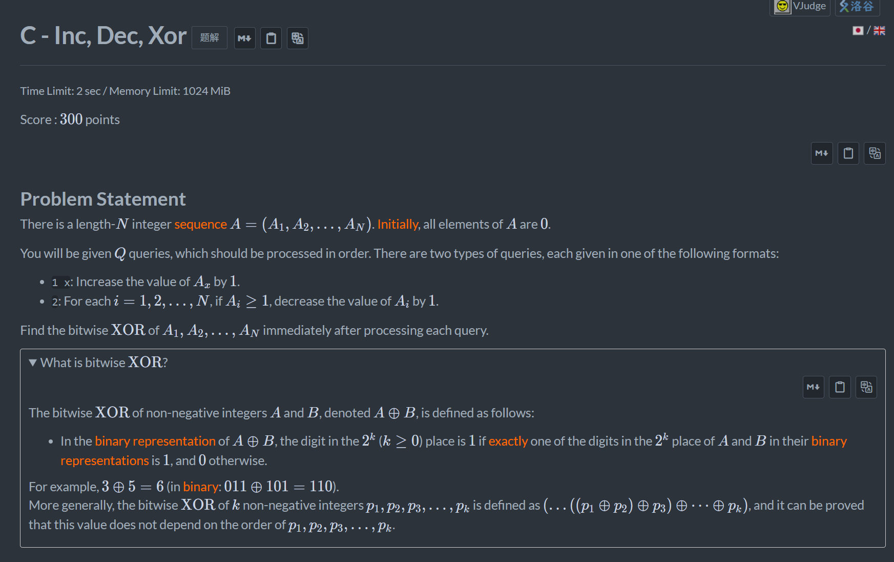
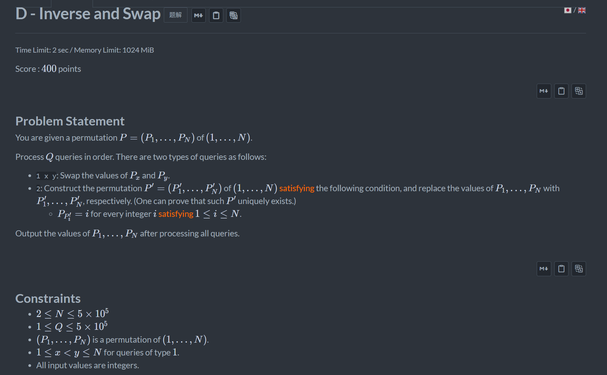

+++
title = 'Abc_470'
date = '2026-08-27T10:16:03+08:00'
draft = false

tags = ['abc']
categories = ['题解']

author = 'Luo Hong'

showReadingTime = true
showTableOfContents = true
showWordCount = true
+++

## C

操作1每次增加1，操作二只要我们每次处理非0的数的下标，时间复杂度其实并不高，直接暴力即可。

## D

手玩一遍能发现操作二连续进行两遍就会变回原数组，所以直接维护两个数组即可得到答案。