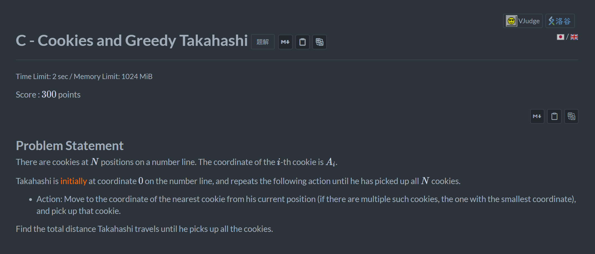
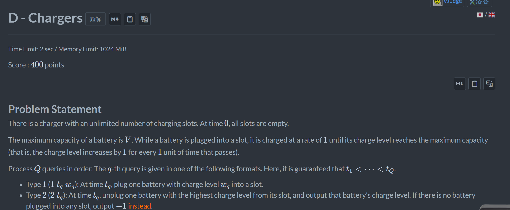
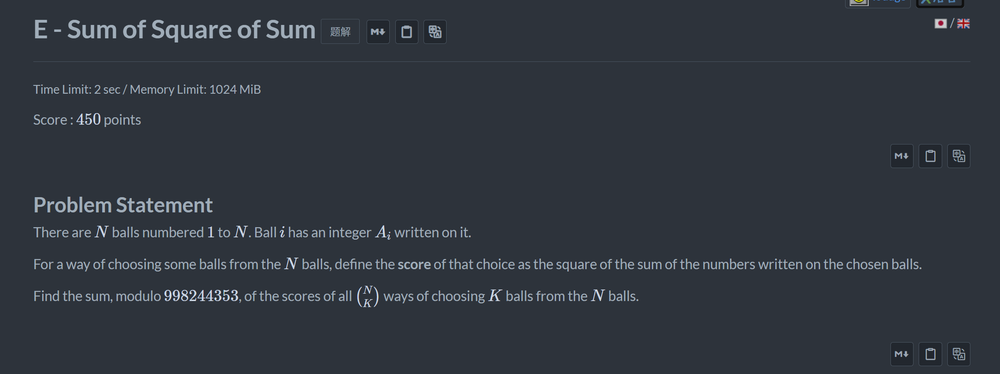
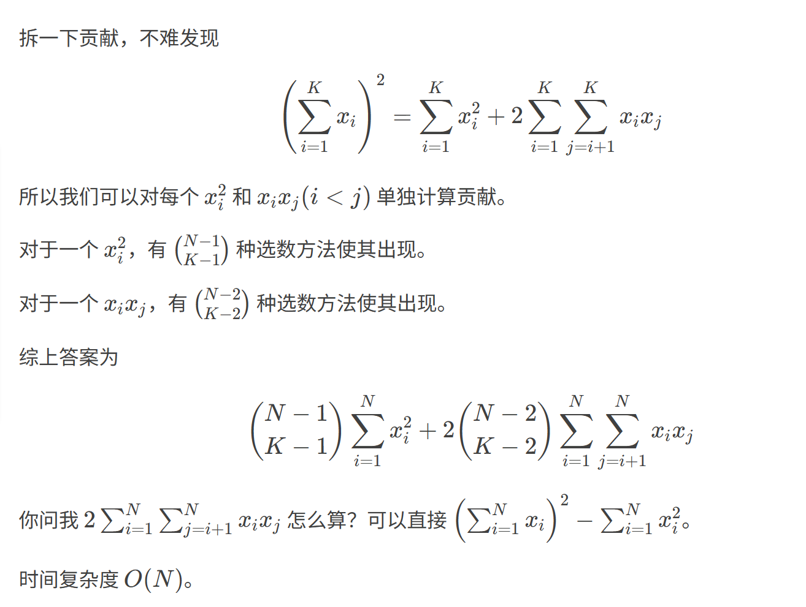

+++
title = 'Acb_471'
date = '2026-09-01T10:19:46+08:00'
draft = false

tags = ['abc']
categories = ['题解']

author = 'Luo Hong'

showReadingTime = true
showTableOfContents = true
showWordCount = true
+++
## C

高桥总是会在一条数轴上左右来回走，那么我们可以用大根堆和小根堆存负数和正数，模拟高桥的选择然后计算答案。

## D

如果总是随着时间暴力增加所有电池的电量，一定会超时。
我们可以发现，一个电池插入插口后，充满电的时间点是确定的。那么每次查询2我们找充满电时间点最小的电池，该电池一定是当前电量最大的电池，具体电量可以通过$V-(t_{\text{充满电的时间点}}-t_q)$计算。我们可以用小根堆维护电池充满电的时间点，实现log(n)查找电量最大的电池，总体复杂度(n*log(n))
## E

非常清晰的题解,来自<a href="https://www.luogu.com.cn/article/ykzd0pyc" target="_blank">Hamburger999</a>

