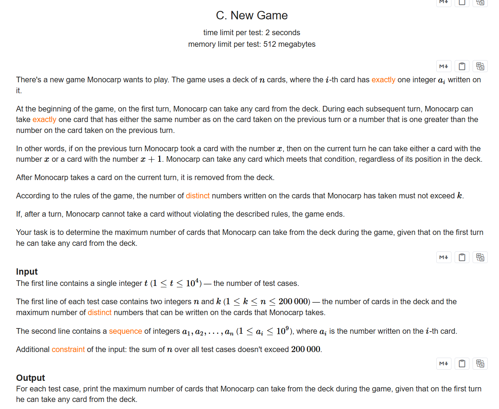

+++
title = 'Ed170'
date = '2026-09-20T16:43:19+08:00'
draft = false

tags = ['Codeforces']
categories = ['题解']

author = 'Luo Hong'

showReadingTime = true
showTableOfContents = true
showWordCount = true
+++

## A
### 略
---
## B

---
## C

### 题意
给出一个数组，求子数组长度，子数组元素大小连续，且种类数不超过k。

### 思路
既然求连续子数组，并且要维护子数组的一些状态，那么可以用双指针。

维护l和r指针，l指针自增，r指针随着l的变化，总是维护“指向满足条件的子数组的最后一个下标”即可。

---
## D