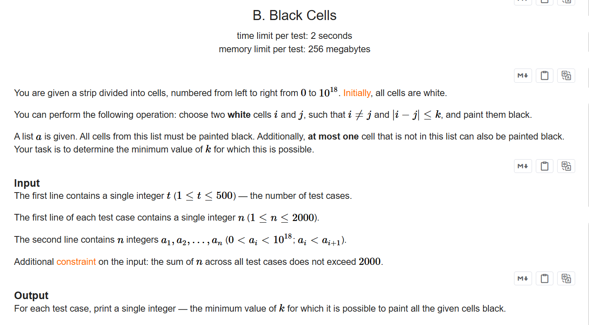
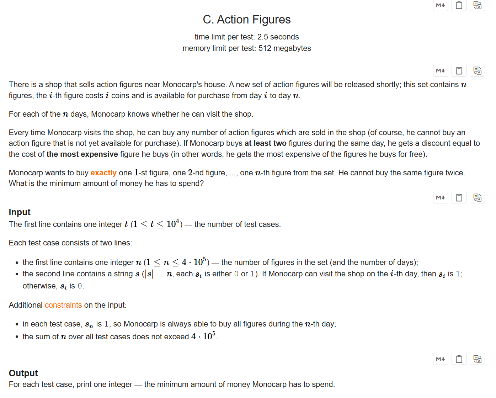

+++
title = 'Ed171'
date = '2026-09-20T17:03:47+08:00'
draft = false

tags = ['Codeforces']
categories = ['题解']

author = 'Luo Hong'

showReadingTime = true
showTableOfContents = true
showWordCount = true
+++
## A
### 略
--- 
## B

### 题意
求数组中，最小的相邻两个数差值的第二大的值。
### 思路
直接实现即可

---
## C

### 题意
有n个娃娃，按照1-n的下标标记，表示上架时间，求购买所有娃娃花费最小的钱。购买娃娃有如下限制：
- 只有在给定的下标处，才能购买一次娃娃。并且只能购买下标小于等于该下标的娃娃。
- 一次购买两个以上的娃娃，最贵的娃娃将免费。
### 思路
因为要求最小的花费，所以先考虑贪心。根据题目限制，我们必定会选择购买当天上架的那一件，因为它是所有可以购买的商品里最贵的一个。从下标n向1枚举，如果当前商品时当天可购买的，我们用一个小根堆存下商品的花费。如果当前为非当可天购买的娃娃，就直接累加这个商品的花费到答案，并弹出堆里一个商品的花费。如果剩下的商品数量小于堆的大小，那么这些商品肯定买来使堆里的商品免费了，所以直接计算所有的花费即可。枚举完即得到答案。

---
## D