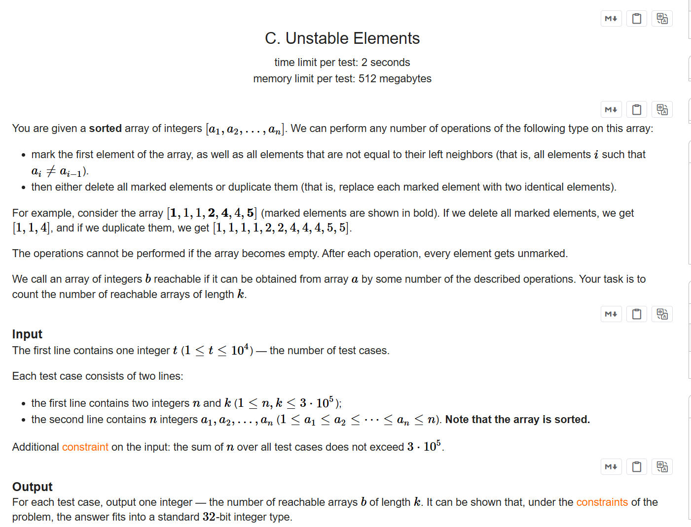
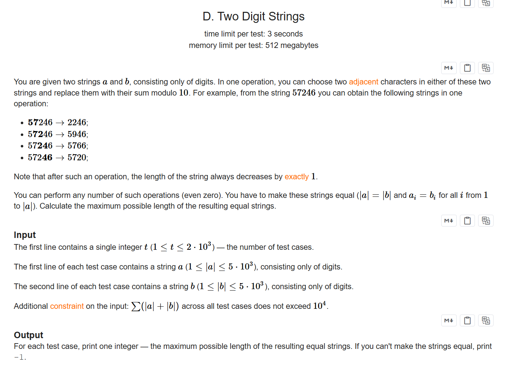

+++
title = 'Ed192'
date = '2026-09-20T15:44:43+08:00'
draft = false

tags = ['Codeforces']
categories = ['题解']

author = 'Luo Hong'

showReadingTime = true
showTableOfContents = true
showWordCount = true
+++

## A
### 略
---
## B
### 略
---
## C

### 题意
给出排好序的数组，进行任意轮操作，每轮操作标志数组中每种数的一个，可以删除他们，也可以将其复制一遍加入数组。问有多少种方法可以使数组长度为k。

### 思路
对于数组长度的修改总是围绕数字的种类数进行的，所以我们可以通过模拟删除操作，判断每次删除后是否可以通过复制到达长度k，或者删除后长度就是k。

模拟过程：用小根堆维护每种数的数量值，当删除操作大于堆顶时，就弹出堆顶。剩下的种类数就是堆的大小。

---
## D

### 题意
给出两个字符串，可以对他们进行任意次操作，每次操作取两个相邻的数字，替换为他们的和对10取模。求两字符串相等时长度的最大值。本质是对操作进行枚举，不太可能有结论，所以应该考虑dp。

### 思路
对于一段连续的数字，不管合并顺序如何，取模后结果都是一样的。所以我们可以预处理对10取模的前缀和。对于两个预处理好的数组，如果有预处理值一样的下标，那么根据数学知识，必然能通过合并得到一样的数字。依靠这两个发现，我们能进行一次二维dp。

dp[i][j]表示下标为i的字符串x和下标为j的字符串y，能通过合并得到的最大相同字符串长度。当两个预处理数组最后一个值不一样时，答案为-1，否则答案dp[n][m]