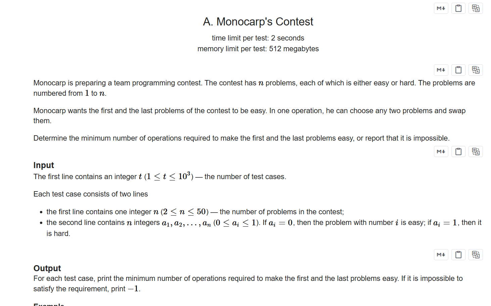
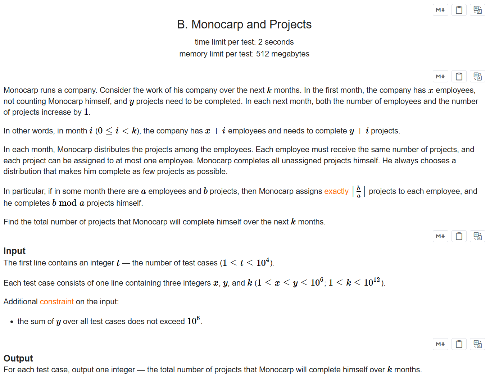
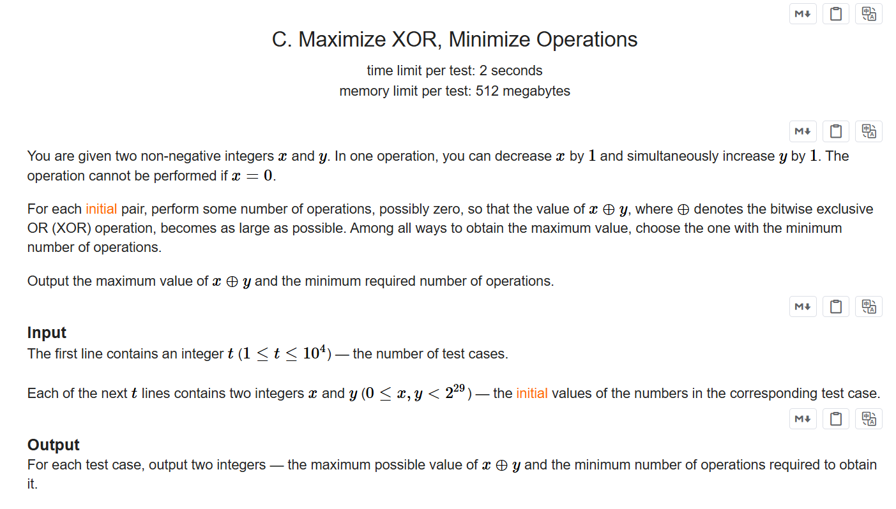

+++
title = 'Ed194'
date = '2026-09-20T14:51:08+08:00'
draft = false

tags = ['Codeforces']
categories = ['题解']

author = 'Luo Hong'

showReadingTime = true
showTableOfContents = true
showWordCount = true
+++

## A

### 题意
要求序列首尾的元素为0，求操作次数
### 思路
简单的分类讨论即可

---
## B

### 题意
给出x和y，求变化k次后模数的和

### 思路
列出计算式，发现不好优化，所以考虑打表找规律

然后发现变化次数在0到y-x的范围内模数有变化，超过这个范围就是一个固定值了，所以分两段求和。

---
## C

### 题意
给两个数，可以进行任意次操作：x减去1，同时y加上1.问得到的最大的x^y是多少

### 思路
首先我们要知道，异或操作是不进位的加法，有x+y>=(a^b),其中a+b==x+y。

那么我们知道了x+y的最大值，那么我们可以贪心地构造出x^y的值。根据最大值MAX的二进制位进行判断，如果该为y的二进制位为0，x大于这个二进制位的值，我们就能将该位构造为1，减少x和增加y.如果该位y本来就等于1，那么就不用进行操作，最终答案就是操作完成的x和y的异或和

---
## D