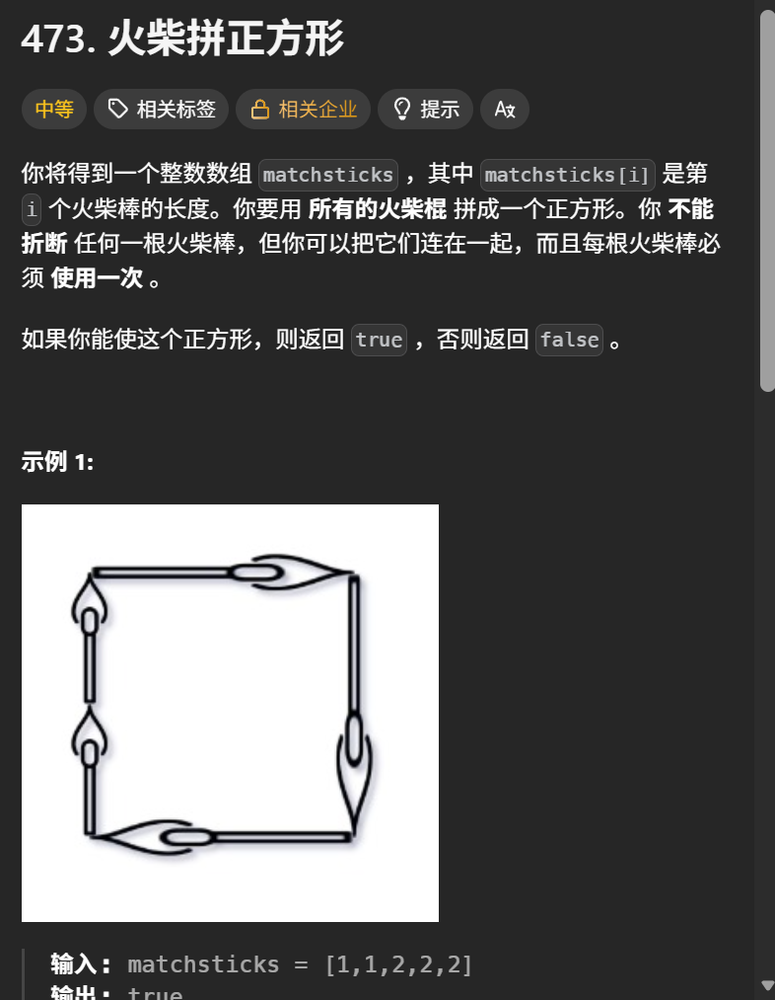
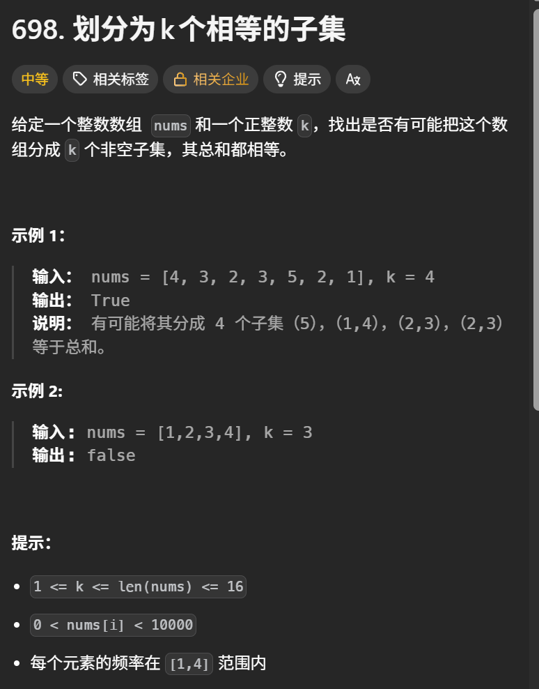

+++
title = '状压dp上'
date = '2026-09-01T21:01:22+08:00'
draft = false

tags = ['算法学习']
categories = ['算法']

author = 'Luo Hong'

showReadingTime = true
showTableOfContents = true
showWordCount = true
+++

基本思路：使用位信息来表示状态，然后进行dp或者记忆化搜索

例题如下
## A
https://leetcode.cn/problems/can-i-win/

我们可以通过暴力递归找先手必赢的情况，使用状压数组来保存已经遍历的状态。

状压数组的状态表示：在当前的选择方案已经选完的前提下，接下来先手能否必胜。
如果先手必输，那返回给父节点的值就是父节点必赢，否则父节点不会赢。

## B
https://leetcode.cn/problems/matchsticks-to-square/

计算所有火柴的长度和，那么正方形的边长就已知了。

接下来就只需要枚举选择任意数量，且未选择的火柴，能否恰好组成正方形的边长，四条边长都枚举完或者发现组成不正确，返回true或者false表示是否组成成功，用状压数组存状态并剪枝。

## C
https://leetcode.cn/problems/partition-to-k-equal-sum-subsets/

既然要把数组分成k个总和相同的子集，那么整个数组的和必然是k的倍数。

和B题几乎一样的解题思路，从数组中选择任意个没选择过数，组成子集，判断其是否恰好满足sum/k，同时满足的子集为k个，用状压数组存状态并剪枝。

## D
https://www.luogu.com.cn/problem/P1171

非常状压dp的题，使用二进制位表示每一个村庄是否走过，这样得到的数作为dp数组的下标，保存这种方案下所走的最短路程。

弄清楚状压数组后，暴力递归所有可能方案数，用状压数组剪枝，当所有村庄都走完后，当前方案的总路程加上最后一个村庄到1号村庄的路径长，即为一种可能的最短路。

