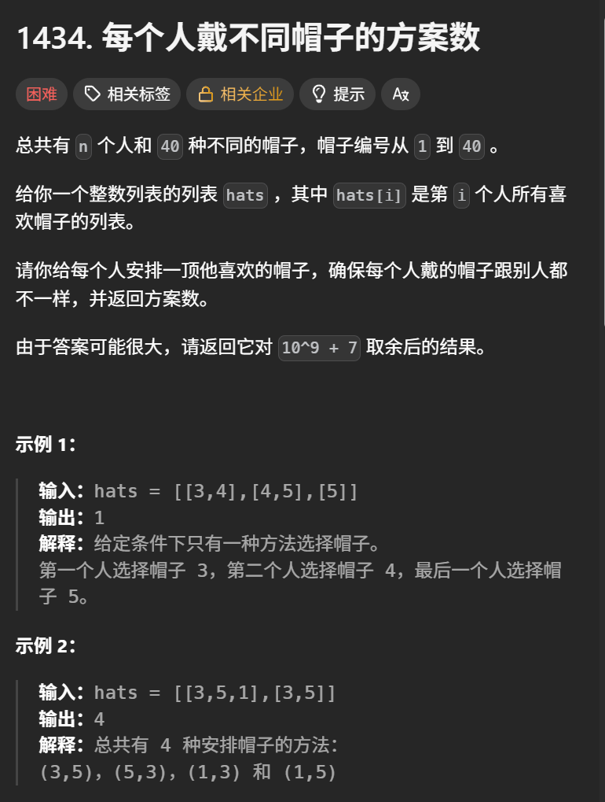
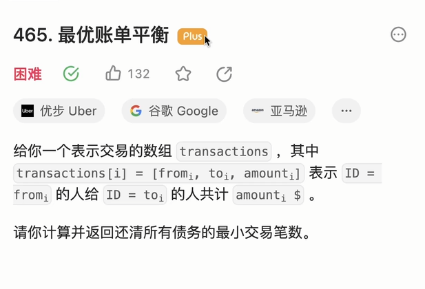
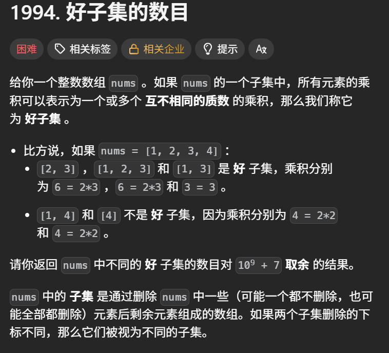

+++
title = '状压dp下'
date = '2026-09-04T22:12:54+08:00'
draft = false

tags = ['算法学习']
categories = ['算法']

author = 'Luo Hong'

showReadingTime = true
showTableOfContents = true
showWordCount = true
+++

## A

使用状压dp。由于n个人是必选，帽子是非必选，所以考虑用下标的二进制位表示第i个人是否已经被选择，1表示没有被选择，0表示被选择过了。

用数组将每个帽子的喜欢的人保存，这样之后我们就可以开始跑递归搜索了：

用状压数组保存：已经按照当前下标表示的方案，分配好了帽子的情况下，剩下的人还有多少合法的方案数。

## B

## C

