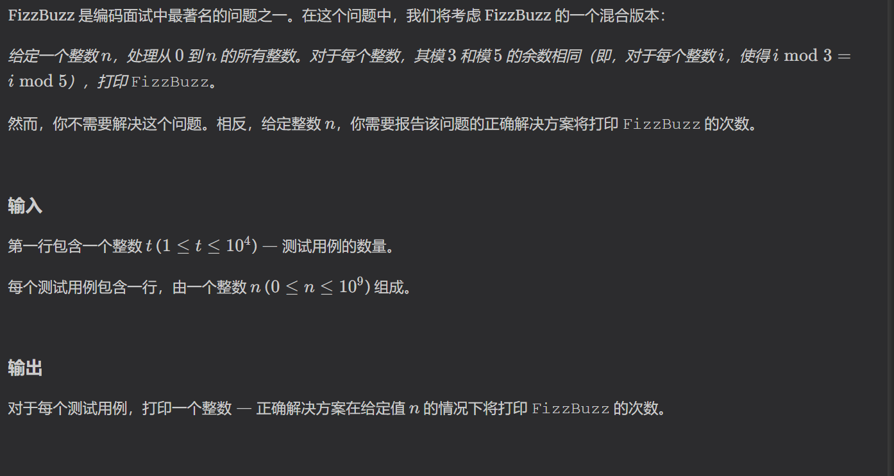
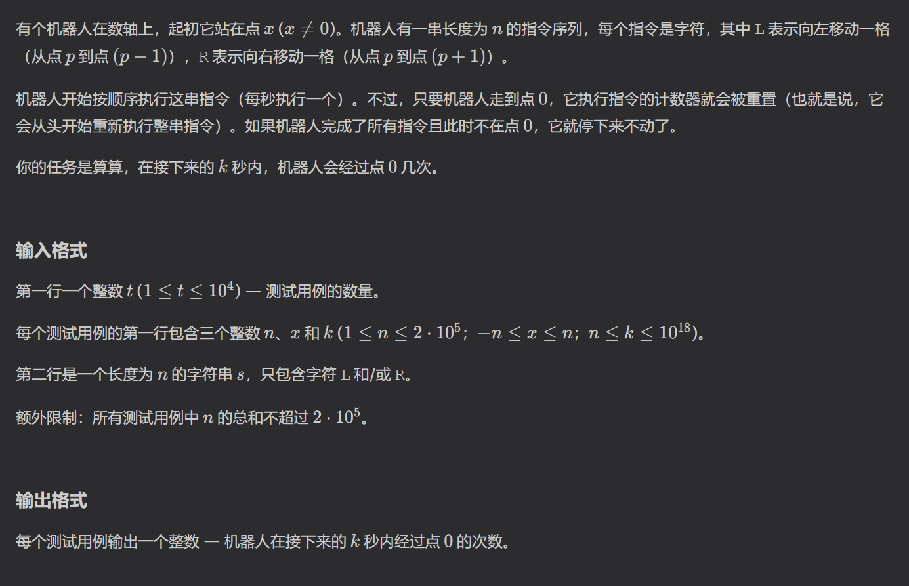
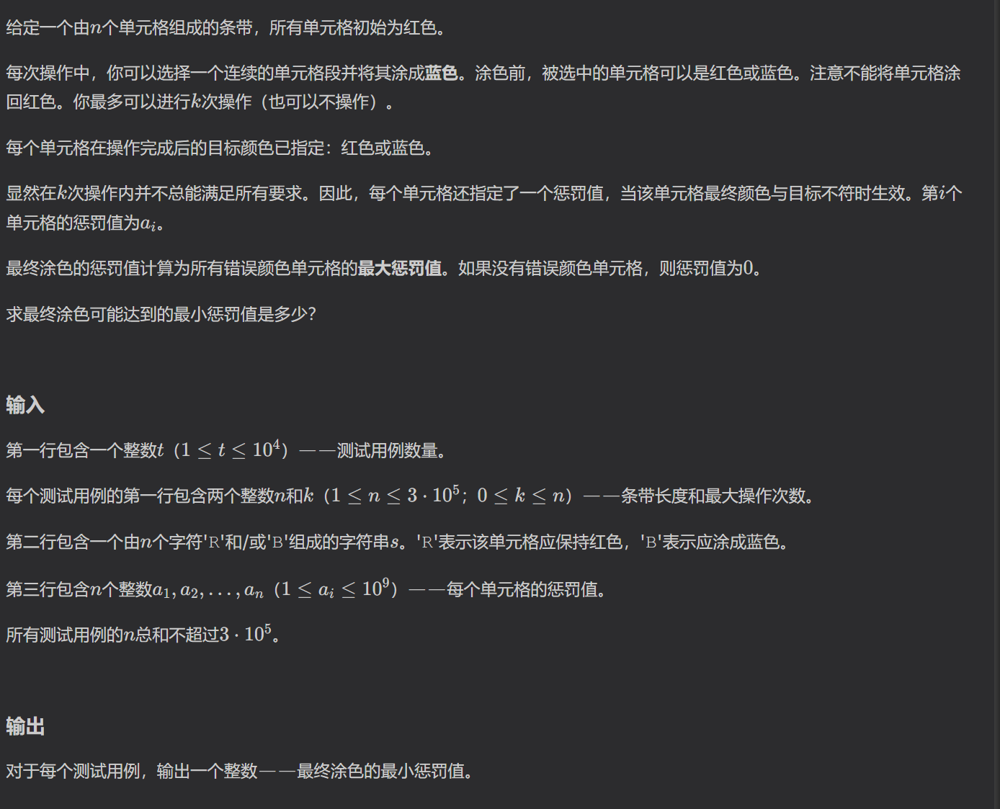

https://codeforces.com/problemset/problem/2070/A

求对3和5取模结果相等的数的个数，模拟即可发现，取模得到的数只能是0，1，2，且每15个数重置一次，所以对15取模后再单独计算个数即可

https://codeforces.com/contest/2070/problem/B

模拟，模拟一遍题意即可发现，我们需要遍历两次序列，第一次查找什么时候机器人从原点走到0点，第二次查找在0点什么时候走回0点，这两部分会构成区间和循环，在这些区间里找答案即可。

https://codeforces.com/contest/2070/problem/C

二分答案，要求整个序列可能的最大值，根据题目条件意思，这个答案在数组中具有单调性。可以二分最大值，然后遍历整个数组，如果一串连续的元素最大值小于要二分的答案，那么我们永远可以贪心选择涂或不涂颜色。记录下实现满足序列最大值的涂的次数是否在允许范围内，即可求二分出答案。

https://codeforces.com/problemset/problem/2070/D
二分图