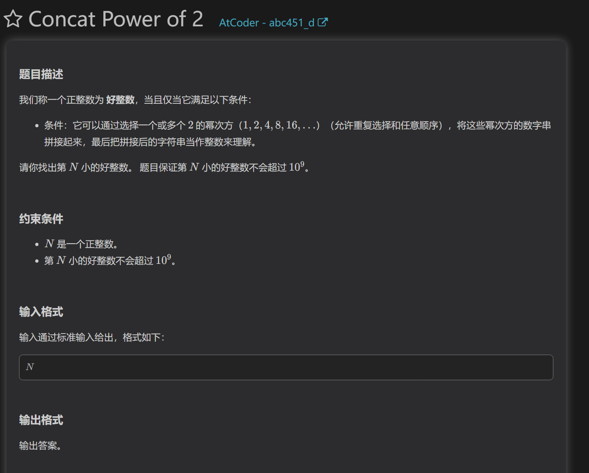
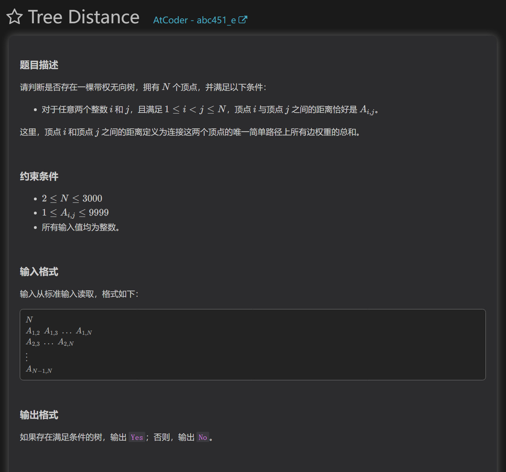
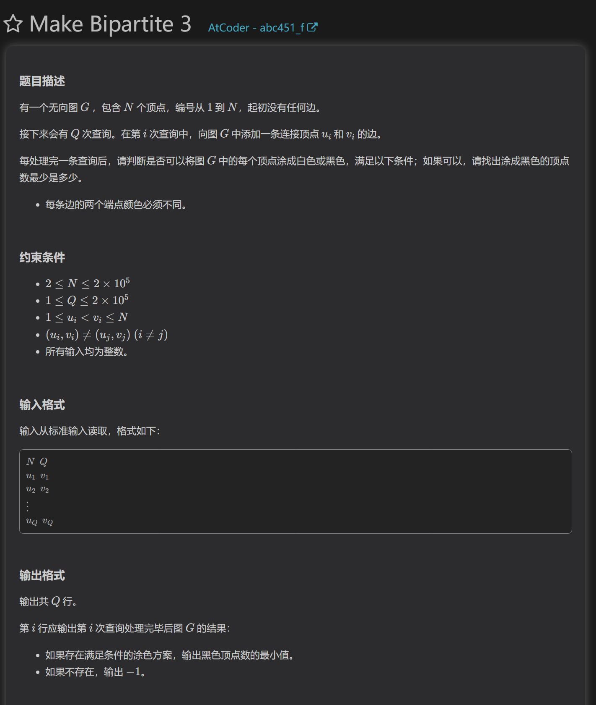

https://atcoder.jp/contests/abc451/tasks/abc451_a
https://atcoder.jp/contests/abc451/tasks/abc451_b

https://atcoder.jp/contests/abc451/tasks/abc451_c
数据结构
使用一个大根堆维护答案即可

https://atcoder.jp/contests/abc451/tasks/abc451_d
暴力枚举

通过题目条件我们可以知道：2的幂次不会超过30。所以我们可以考虑枚举。
建立一个小根堆或者vector数组，反复拼接这三十个幂次，中途去重即可。

https://atcoder.jp/contests/abc451/tasks/abc451_e
最小生成树，暴力枚举

首先要构造这棵树，我们可以用最小生成树构造。
然后对每个点进行dfs判断是否满足题目条件

https://atcoder.jp/contests/abc451/tasks/abc451_f
暴力，二分图

首先我们得到n个连通分量，涂色操作需要在连通分量上进行
对于每个连通分量，我们可以把每个节点都分成奇点和偶点，这个连通分量的最少的黑色点就是对奇点和偶点取min

那么我们直接根据q次操作连接连通分量，将较小的连通分量并在大的上面并重新标记奇点和偶点。如果本身就在一个连通分量，那么比较两点的奇偶性判断是否有冲突。
