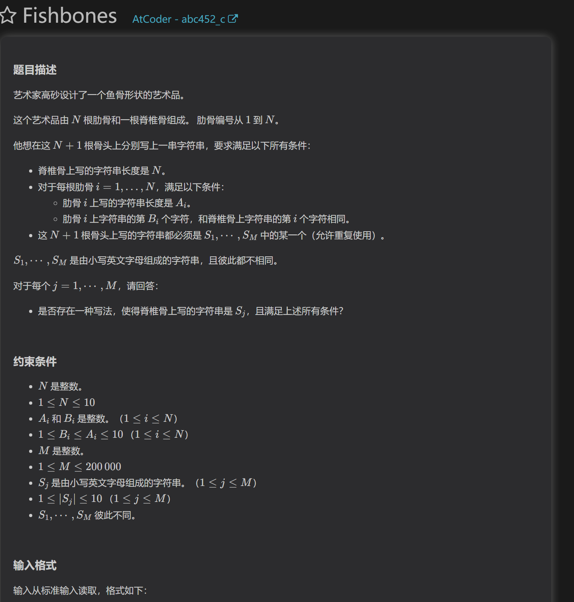
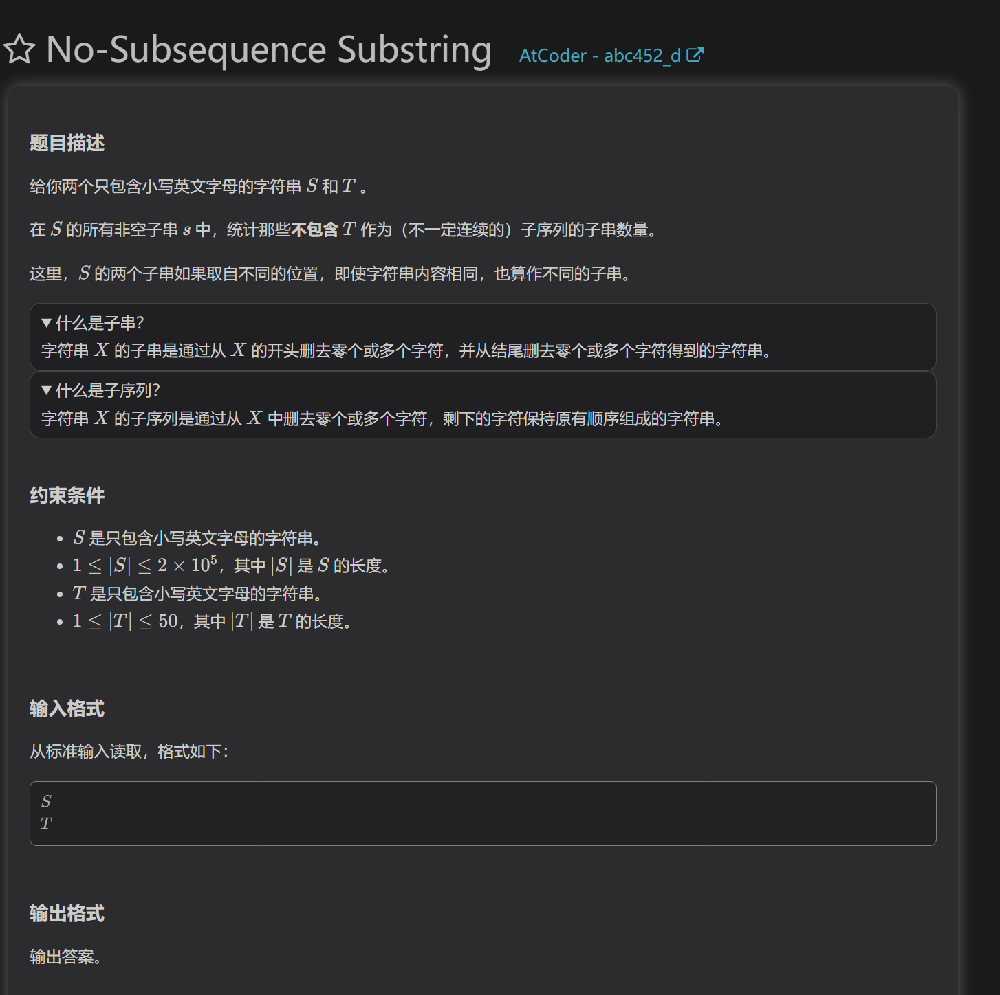
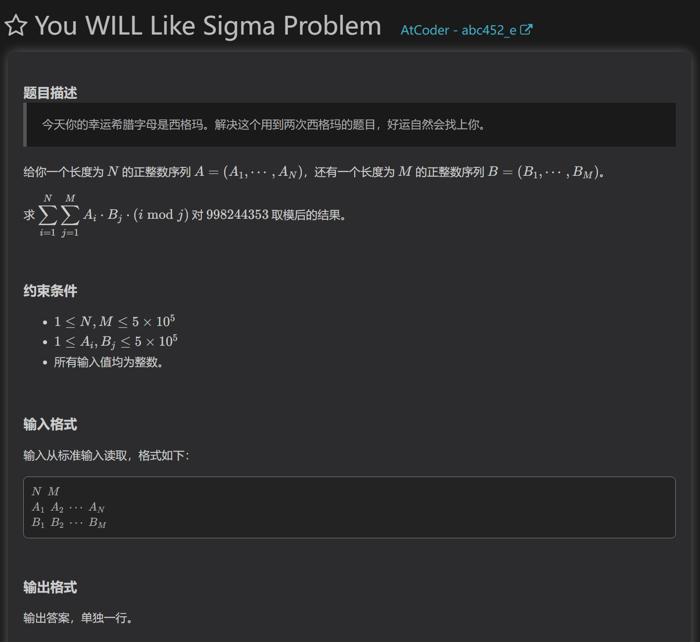

AB略

https://atcoder.jp/contests/abc452/tasks/abc452_c

预处理
对每个肋骨能取的字符串进行处理，将其能得到的对应位置脊椎字母填入位置i，表示如果在第i个位置，我们可以选择这些字母。
然后对每个符合长度的字符串进行遍历，每个符合条件的字符串输出yes

https://atcoder.jp/contests/abc452/tasks/abc452_d   

dp
研究发现，需要dp计算答案，不过又分很多种方法
解法一：
对于一段可以选择的字串，必然是不包含T序列的，所以我们通过枚举右端点，表示以第i个数为结尾，前缀串能构造出多少个合法的串。
以i为结尾，i必然有T.length()个状态，表示从前缀串中构造以i结尾，同时以T的第j结尾的字串有多少个。合法的串个数是这些状态的和。
由于是必须连续的字串吗，其dp的方式是特殊的，而且我现在描述不出来。

解法二：
正难则反，先求出全部字串的个数(n+1)*n/2;然后计算非法字串，结果为其差

解法三：

PS：这道题关键在于明白连续字串在dp表中的构成方式，是左端点个数和右端点关系

https://atcoder.jp/contests/abc452/tasks/abc452_e

降维打击公式法
首先是将公式拓展，数学得熟
然后根据整理好的数学公式计算。
很多时候我们需要减少计算次数，这时公式法会带有i/j等类似的结构，保证了i/j必须为整数。这时我们就能通过枚举j和整数，将时间复杂度从n^2降至nlogn