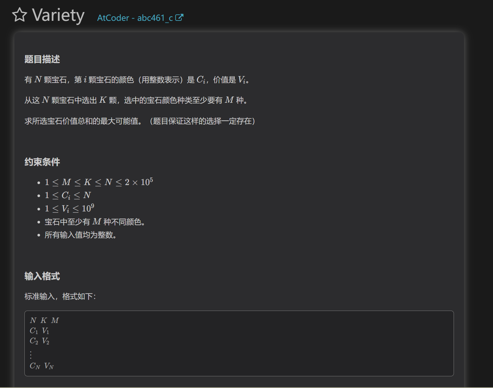
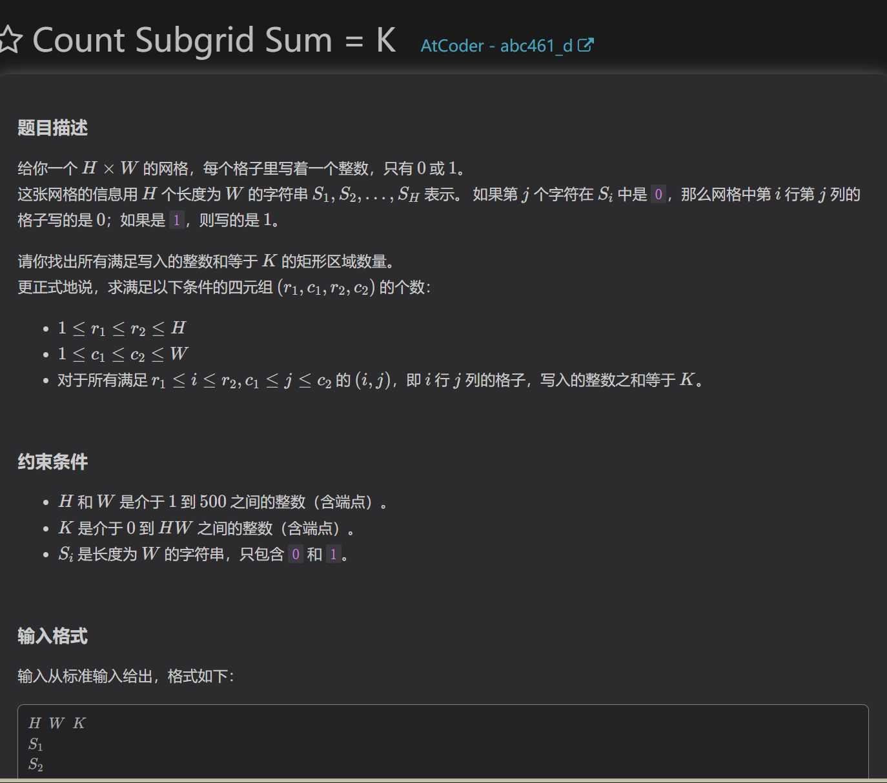
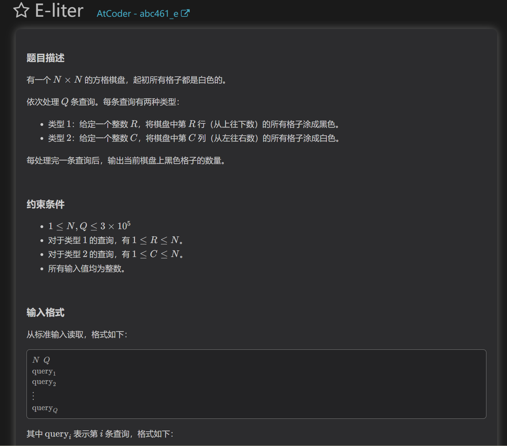

##C

复健第一题，因为题目漏看了至少为M种导致做不出来
如果考虑至少，那么先按照价值排序，选择前m个颜色不同的宝石来保证满足条件二，还有k-m种在剩下的宝石中挑选即可

##D

这是一道用滑动窗口优化的题目。要计算一个矩阵里的所有数，注意到固定一维（如高度），那么剩下一维随着长度增加，数的数量是单调的。所以我们可以想到，枚举矩形的上界和下界，在一个窗口里使用滑动窗口和hash实现三重循环的计数。

##E
    
这道题需要抽象模型，对于二维的矩阵，