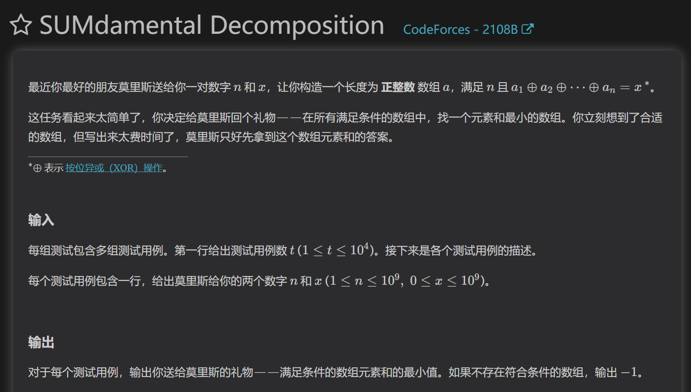
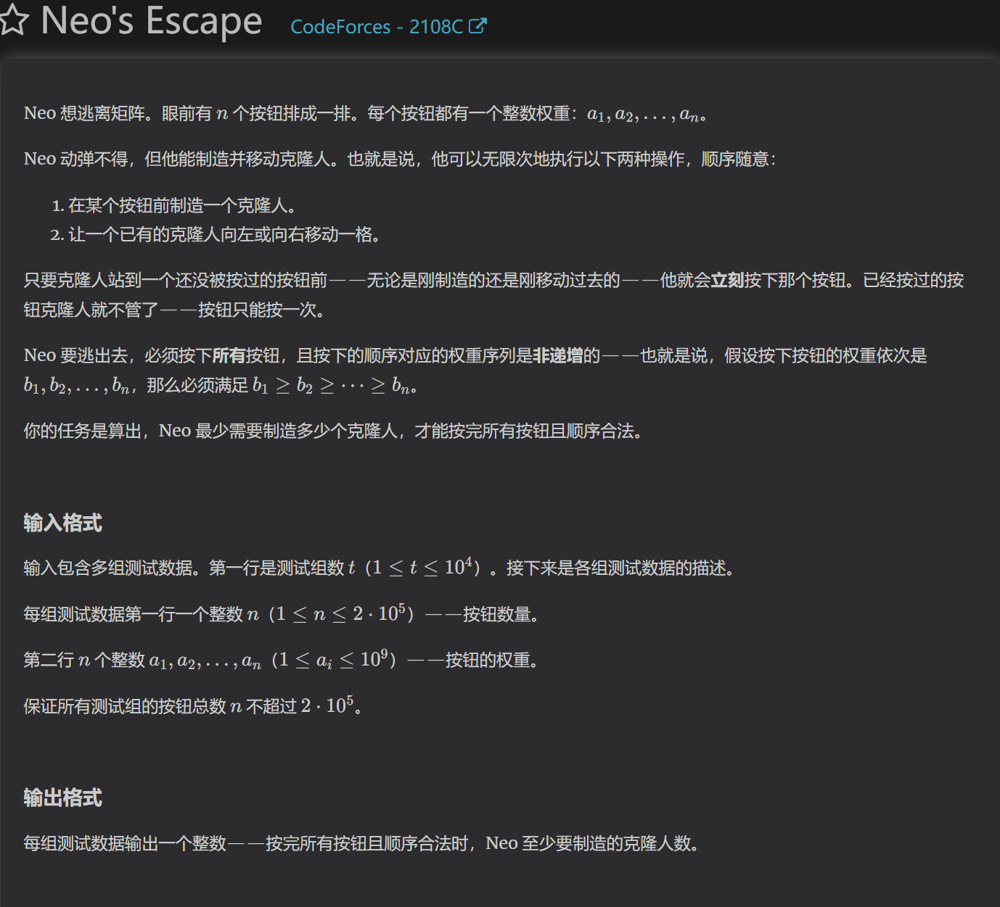

https://codeforces.com/contest/2108/problem/B

简单的贪心，根据题目操作，我们对x的数位进行分解，当n<=numx时花费必定等于x，如果大于时，我们可以通过不断填1来消耗位数，当可以空余填1的位数为奇数时，我们在填过的数位中多填一个1，如果没办法找到，那就填2

https://codeforces.com/contest/2108/problem/C

每次创建新机器人后，都可以在未来向左右两边移动按下按钮，也就是说，如果下一次按的按钮如果有机器人可以到达，那么可以让机器人来按而不用创造新的机器人

解法一：
可以用并查集构建集合，如果一个点的两端是机器人可以到达的集合，那么合并集合，不需要创建，否则需要。

解法二：
由于机器人按下按钮的顺序是递增的，也就是说如果一个点左右存在小于其的点，则必定可以通过机器人移动来按下他，属于递推的关系。可以贪心地在左边或右边的比较设置等于号实现连续相同权值的点必定创建过机器人。（按照递推顺序设置）