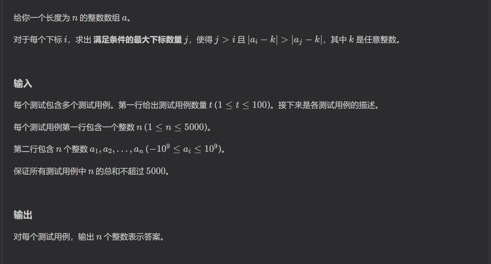

https://codeforces.com/problemset/problem/2209/A
要想得到最大的c，那么每次都要尽可能的增加自己的实力，所以每次都要贪心的增加自己的战斗力

https://codeforces.com/problemset/problem/2209/B

满足条件的数可以分为两类，一类是大于选取数的数，一类是小于选取数的数，分开计数取最大值即可。

https://codeforces.com/problemset/problem/2209/C
屎题