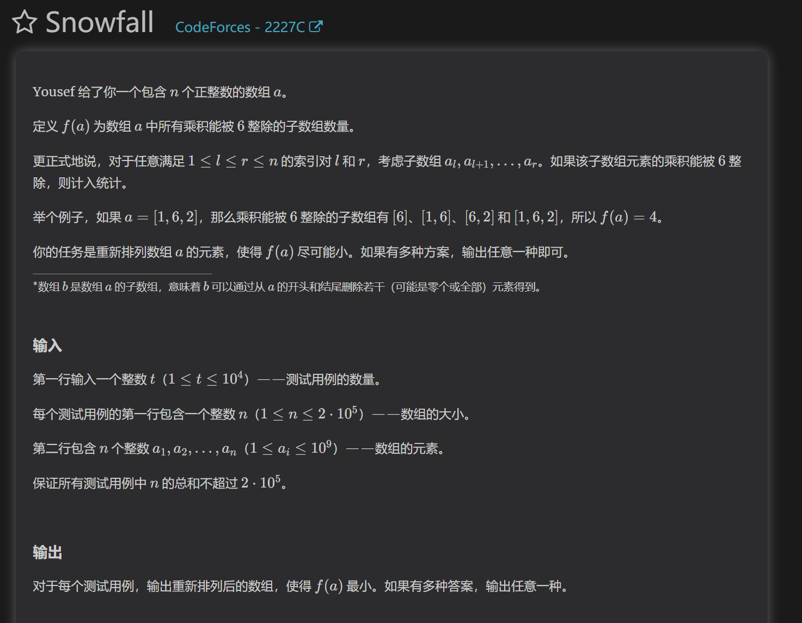
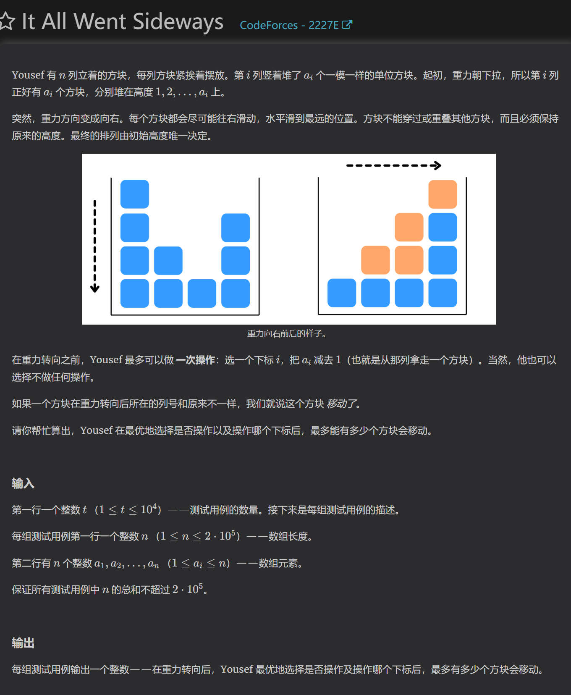
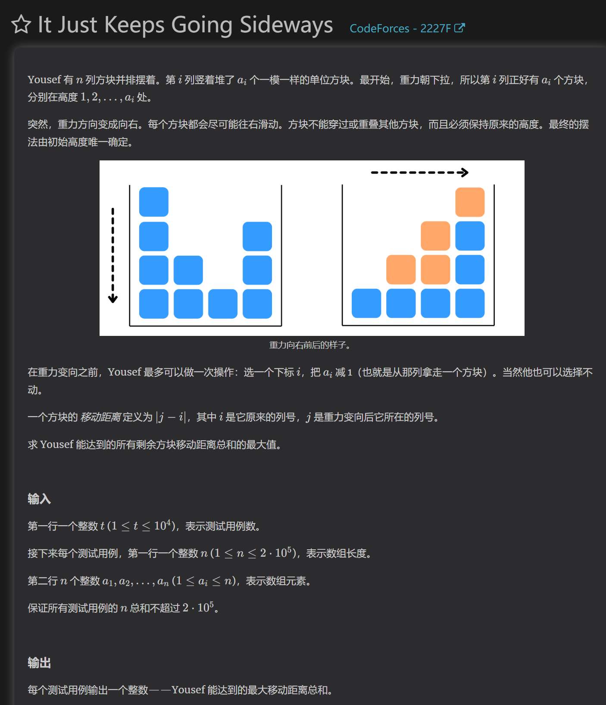

https://codeforces.com/contest/2227/problem/C

要想让子数组元素的乘积为6的倍数数量最小，可以将6的因数分解，将因数分组构成的数组得到的数量肯定是最小的
所以所有数可以分成四种
 -只是2的倍数
 -只是3的倍数
 -是6的倍数
 -以上都不是
按顺序把这四组输出即可

https://codeforces.com/contest/2227/problem/D

暴力判断，分别对0为最中间的序列，一对0组成的序列判断长度，输出最大的一组答案即可

https://codeforces.com/contest/2227/problem/E

简化题目意思：
经过操作后，会有移动和未移动的方块，一列抽出一个方块后，可以使多少未移动方块变成移动方块。

我们可以发现，没有发生移动的方块，和右边一列的方块有这样的关系：未移动的方块一定小于等于右边未移动的方块。
所以我们就能预处理出所有不会移动的方块，然后遍历没一列，从底下抽出一个方块，左边所有列有多少未移动块大于改变后的这一列未移动块的高度。

https://codeforces.com/contest/2227/problem/F

已HACK-ac代码
经过分析，每次移除一个块，他增加的贡献如下：
贡献为其左边大于等于这一列高度数量，减去这个格子向右移动的贡献
那么我们就可以通过枚举每一列移除块得到的最大贡献了

然后我们需要计算不移除的总移动距离，计算方法是，一个块到最右边的距离减去右边同高度的块，那么一行所有的块的总距离就是每个块移动到最右边，然后减去其数量的等差和。

#再做这道题，感悟是之前对题目分析得很细腻透彻，角度切换的非常好。