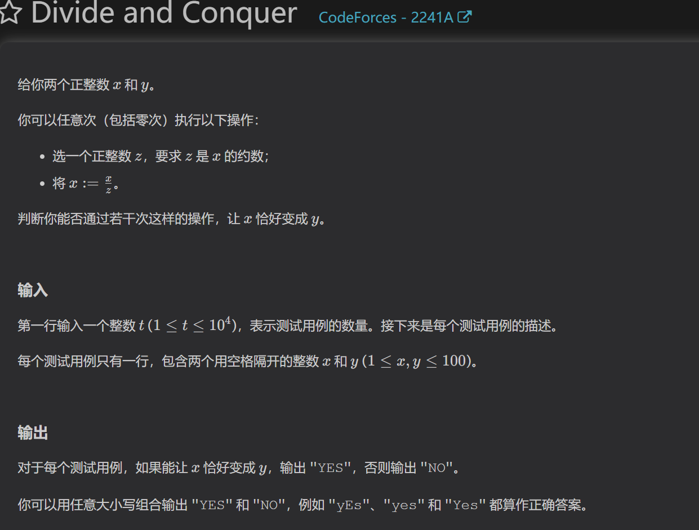
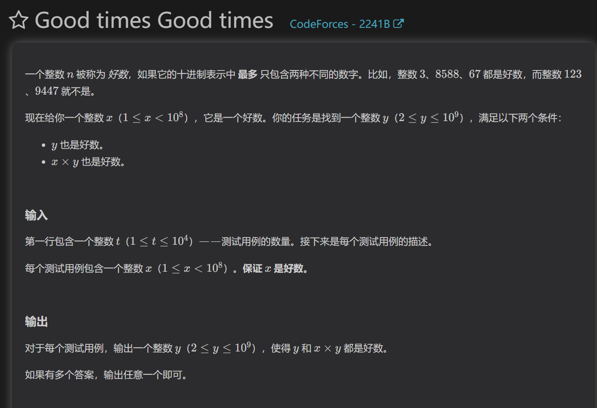
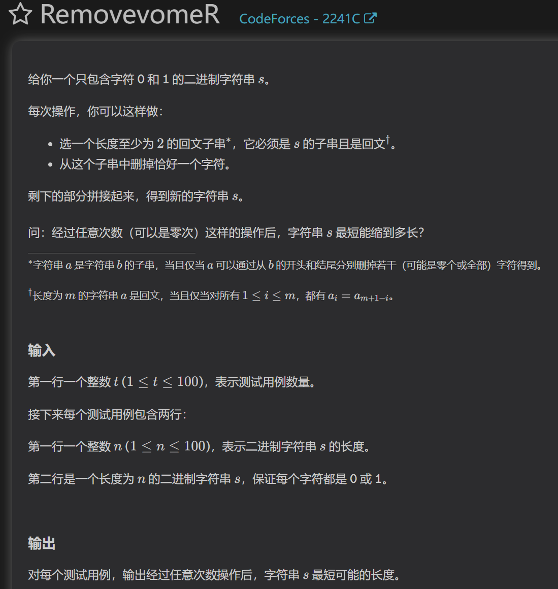
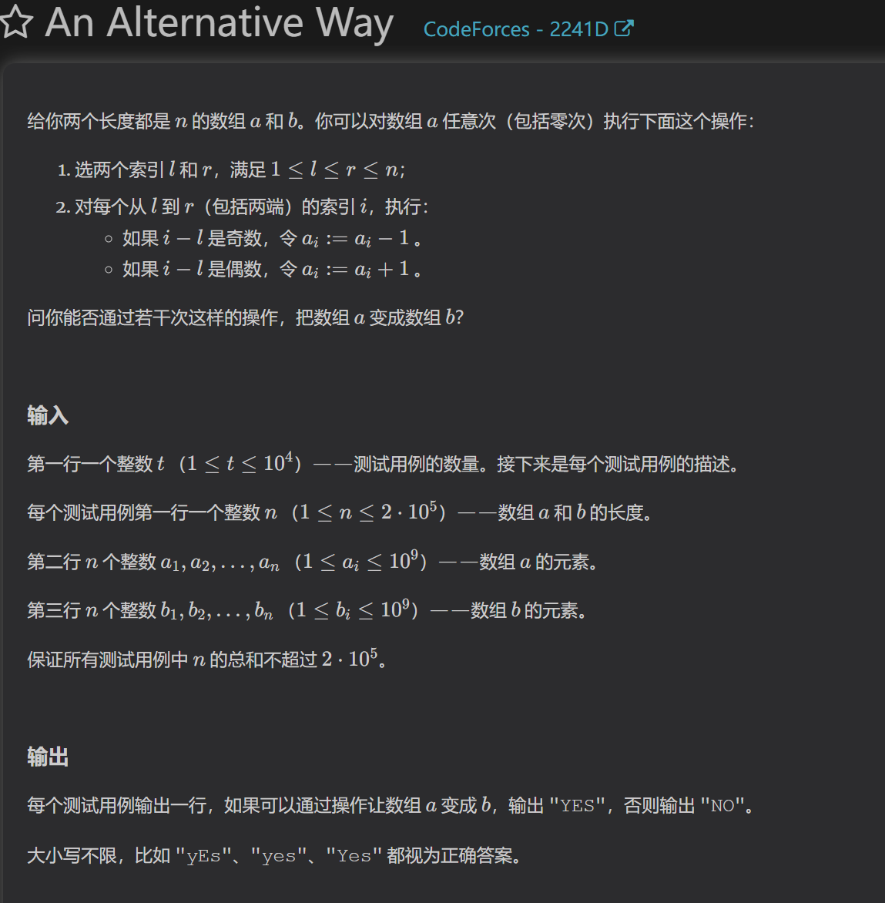
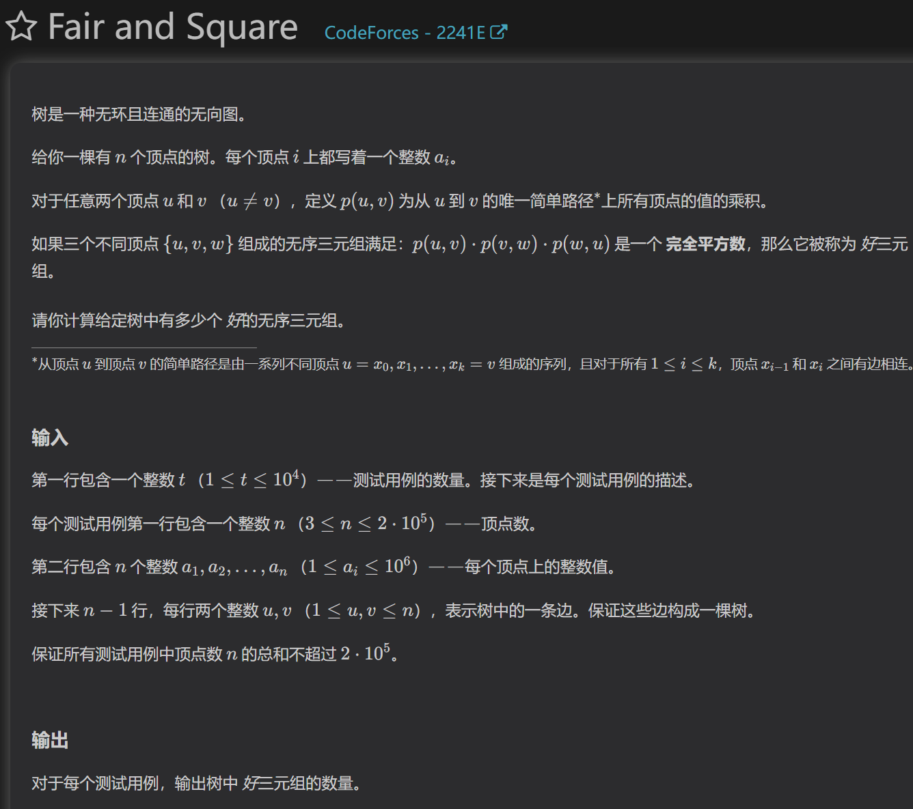
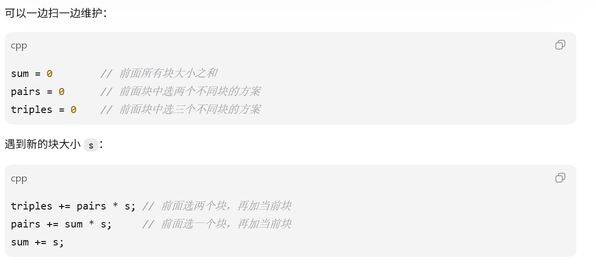

##A

题目条件可以解释为x能变成自己的约数，试问x能否变成y。问题迎刃而解

##B

贪心地想，如果一个数的倍数的十进制必须和本身的十进制位的数种类一致，那我们换个角度想，直接用这个数去构成倍数即可，答案就是1000...1

##C

根据题目操作我们推断：选择最简单的两个回文串11和101，我们发现两种形式都可以删成最简单的1的形式。那么我们对字符串去重，能得到1010101的形式，进而又能得到最简形式。只有首位和末尾不一样时，最终字符串长度才为2.

##D

对于题目操作，我们知道这样的操作能将数组后面的数的值，传递到数组前面去，那么要想保证a数组能通过传递变成b数组，就要保证a的前缀数组和只能比b的少，因为a比b的前缀数组和多无法通过传递减少。所以我们枚举每一位，验证到当前位的前缀数组和的大小是否都满足条件即可。

##E

首先分析题目三元组的构成方式，发现这三条链，总是两两重叠的，这三条链有且最多有一个三条链均经过交点，记为x。由于三条链总是两两重叠的，所以能直接构成平方数。而交点x有三个。所以题目条件公式就变为：一个平方数*x*x*x，只有x本身为平方数时题目条件才成立。
有了这样一个结论，我们可以计算每一个价值为平方数的支点，所能匹配的三元组的和。计算支点分两种情况，一种是三元组里包含x，另一种是不包含x。
计算方法为：

这种扫描线的方法就是dp，