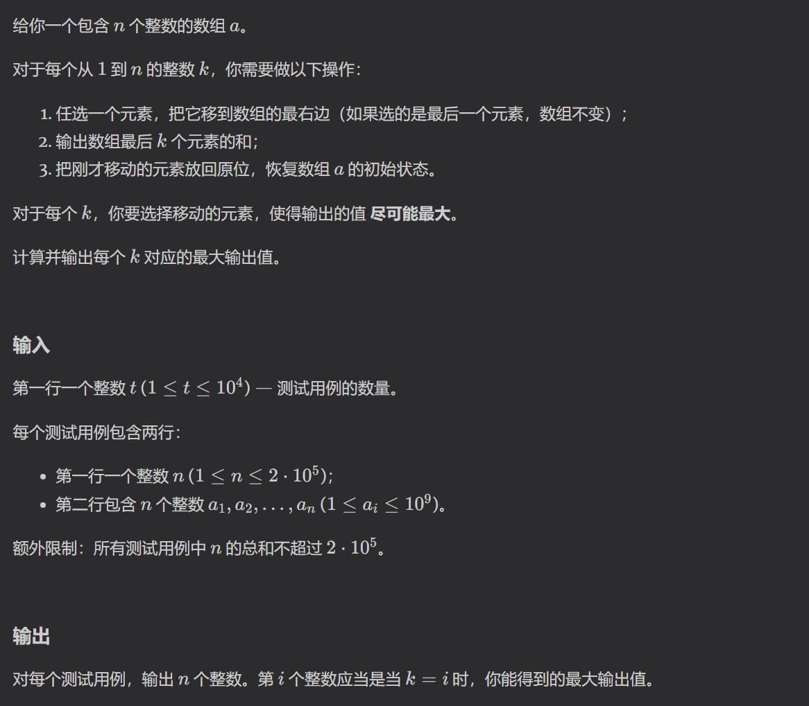
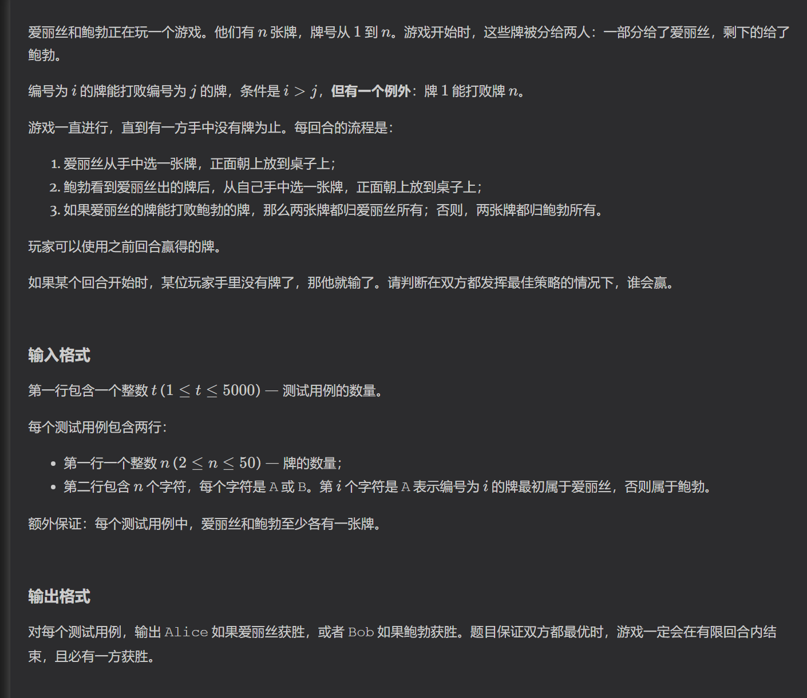
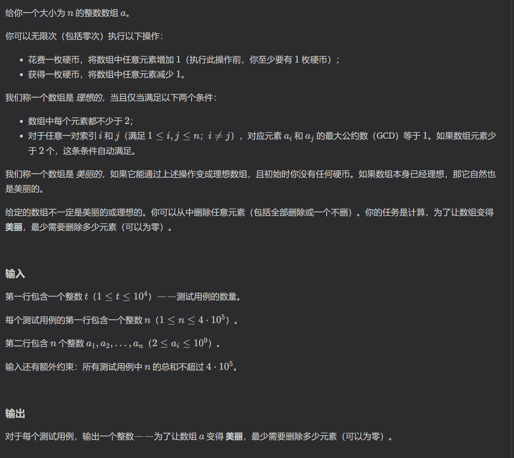

https://codeforces.com/problemset/problem/2204/A
模拟即可

https://codeforces.com/problemset/problem/2104/B

预处理
对后缀求和，对前缀取最大值用于贪心

https://codeforces.com/problemset/problem/2104/C
模拟

模拟判断对于a出的所有牌，b是否都有大于其的牌

https://codeforces.com/problemset/problem/2104/D
贪心/二分

要满足任意两个数的最大公因数都为1，则数组中所有数均为质数。
所以可以预处理出质数，然后对排好序的属于进行累加，当累加和不足以继续维持产生数组时，即为可构造的最大长度

