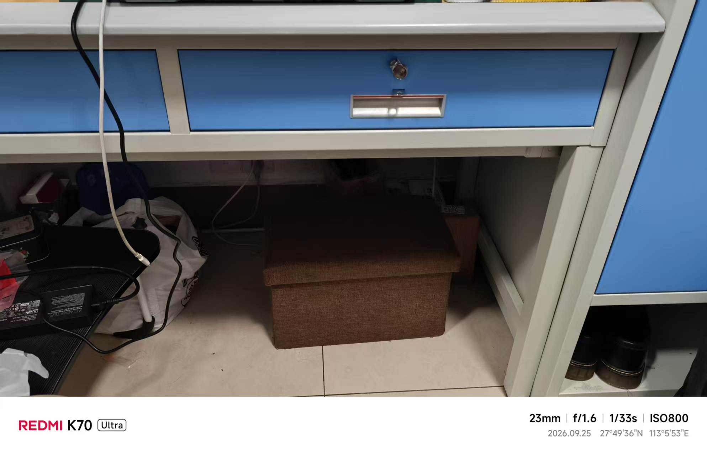
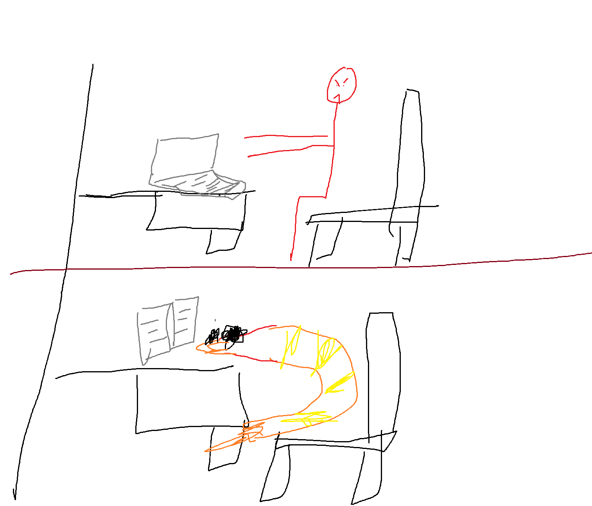

+++
title = '早就不爽了'
date = '2026-09-25T23:08:13+08:00'
draft = false

tags = ['吐槽']
categories = ['杂谈']

author = 'Luo Hong'

showReadingTime = true
showTableOfContents = true
showWordCount = true
+++
## 因为一张很糟糕的桌子
我通常不呆在宿舍里，有很大一部分原因是我的大学配了一个很雷霆的桌子。

这张桌子高度很低，却还要装一个很高的抽屉，下面再叠一根不知意味的横梁。

这就导致人坐在桌前，腿几乎无法伸进桌子下方，要么手伸长扮演清朝僵尸，要么像一只皮皮虾把头凑在桌前。

真是难以理喻 :(