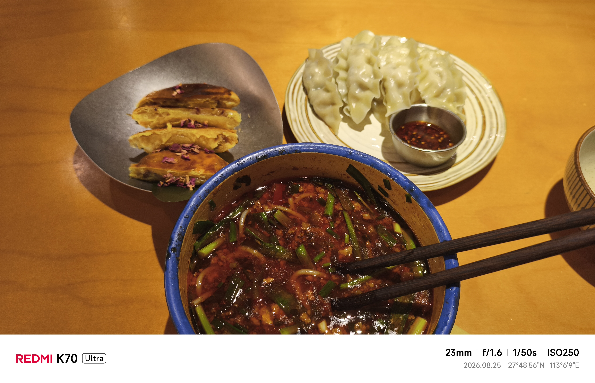
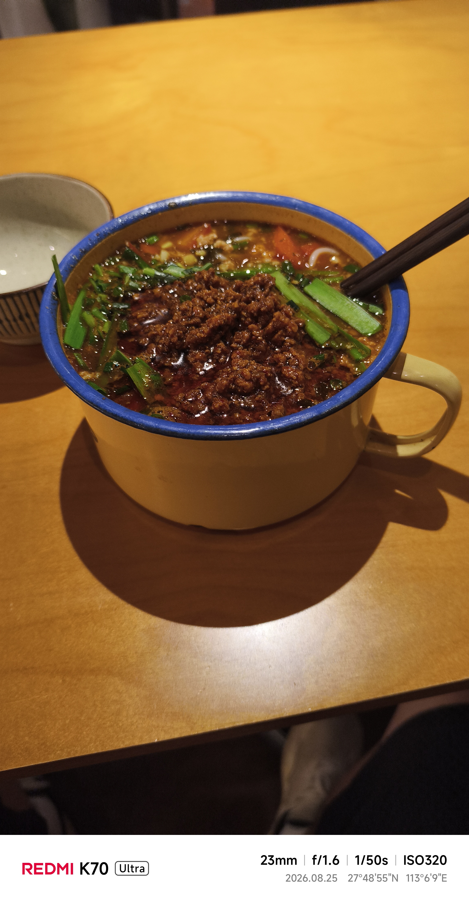

+++
title = '春屿里 云南菜'
date = '2026-09-04T14:34:49+08:00'
draft = false

tags = ['美食']
categories = ['探店']

author = 'Luo Hong'

showReadingTime = true
showTableOfContents = true
showWordCount = true
+++

## 2.0/5.0 昏头了

8月25号，一个平静的傍晚，整天没吃饭的我鬼使神差的走进了这家点，花了近40点下了一份双人餐。

**39.9元 情侣套餐，含有一碗杂酱米线，一份牛肉饺子，一份鲜花饼。**

## 体验
- 杂酱面最先上，第一口吃的是杂酱，咸味适中，肉明显炸过，有股肉香。可惜的是，杂酱是凉的，一整碗面也没有其他调味，吃起来就是**普普通通的米线**。

- 牛肉饺子，是速冻饺子的味道，里面的肉馅吃不出来是牛肉，倒更像绵密的猪肉淀粉馅。

- 鲜花饼，也是普通的速食。
- 店内装修还可以，算是工大周围比较精致的了。

总之不推荐单身汉，想吃美食的同学来，这是一家偏向情侣的餐厅，溢价比较严重。
> 我花40块钱来吃20块钱的套餐，还有20是狗粮钱，用餐期间店内共4对情侣在约会。