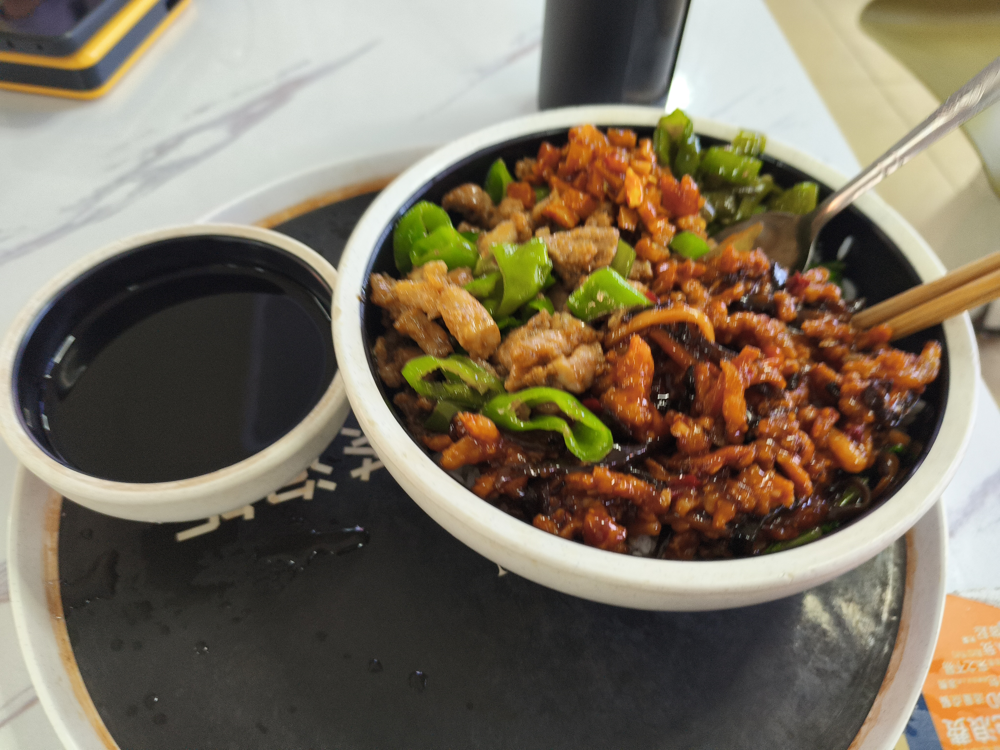

+++
title = '涉外经济学院第四食堂'
date = '2026-09-18T00:26:42+08:00'
draft = false

tags = ['美食']
categories = ['探店']

author = 'Luo Hong'

showReadingTime = true
showTableOfContents = true
showWordCount = true
+++
## 前情提要
由于需要参加蓝桥杯国赛，所以特别前往涉外经济学院。我粗略的游览了一下涉外，感觉挺不错的。教学楼，体育馆，操场，食堂等活动场所分布集中，所以想去哪儿都挺方便。宿舍楼下就是小的购物街，甚至出门马路对面就是操场。在校园里漫步了一会，有一种。。回到了高中的感觉？校内的氛围很松弛，让我想起大课间漫无目的的在校园游荡，一些毗邻楼房的绿植，倒确实也像我高中总时见到的那些树，有种想欲窥楼内一隅的样子。

## 3.7/5.0 赛后一餐
打完蓝桥杯，我一个人走进了涉外食堂，点了一份档口的茶泡饭。

- 好像是单价13元的鱼香肉丝拼青椒炒肉，一碗饭一碗茶。说实话，拿起托盘的时候我感觉这份午餐还是蛮扎实的
- 鱼香肉丝比较甜，汤汁勾芡得有点稠，肉和萝卜比较软，和米饭混搭就剩调料的味道了，感觉像吃酱汁拌饭。
- 青椒炒肉好像是鸡肉？不过味道还行，青椒有煸香味，感觉比鱼香肉丝更下饭。
- 最后我本着茶泡饭必须要有茶泡饭的原则，把茶倒进了饭里，似乎是普洱茶？加到饭里多了一层茶的风味，现有茶香后有菜味，很稀奇！

这一顿午餐，一半是吃饭，另一半是试着体会涉外同学的生活。这顿饭很悠闲，吃完和学长们买上一杯蜜雪，坐上大巴返校了。