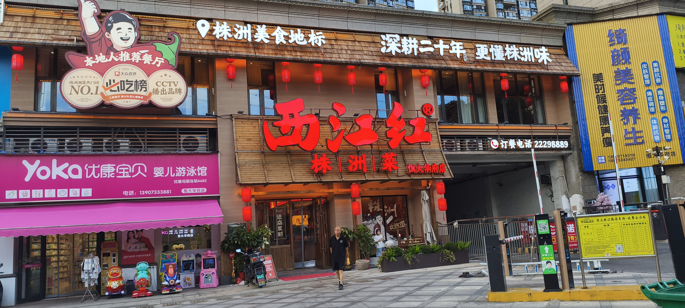
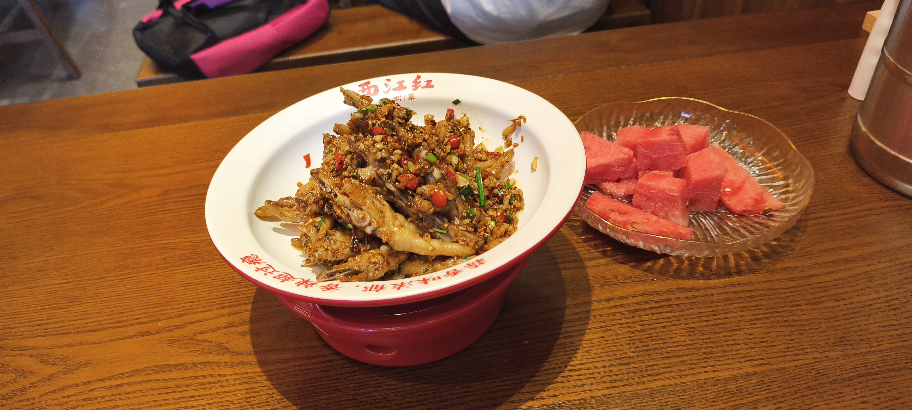

+++
title = '西江红'
date = '2026-09-04T16:23:50+08:00'
draft = false

tags = ['美食']
categories = ['探店']

author = 'Luo Hong'

showReadingTime = true
showTableOfContents = true
showWordCount = true
+++
## 3.8/5.0分 蛮不错
北苑外的马路对面开了一家西江红，之前尝过滨江路的中心店，味道还不错，所以这次又特地去尝了一下。

**我单点了一份招牌鸡爪，共消费51元。**

## 体验

- 鸡爪又香又糯，脱骨入味。
- 味道偏重口，辅料有很多炸大蒜末和香辛料，所以吃起来很香，拌饭也是一绝。
- 一份鸡爪49元，分量对一个人来说很足，两个人有余。
- 店里菜品的价格还是比较合理的，大部分荤菜价格在26-50，个人认为性价比不错。

虽说这家分店的菜单和总店差不多，但味道感觉是总店的二分之三。不过总体是推荐尝一次的。

## 后记
店内主打株洲菜，部分炒菜**汤水偏多，味道偏辣**。说实话，这让我对的炒菜有了新的认识。

“**爆炒肥肠 59元**”的分量少调味淡，**不好吃**。