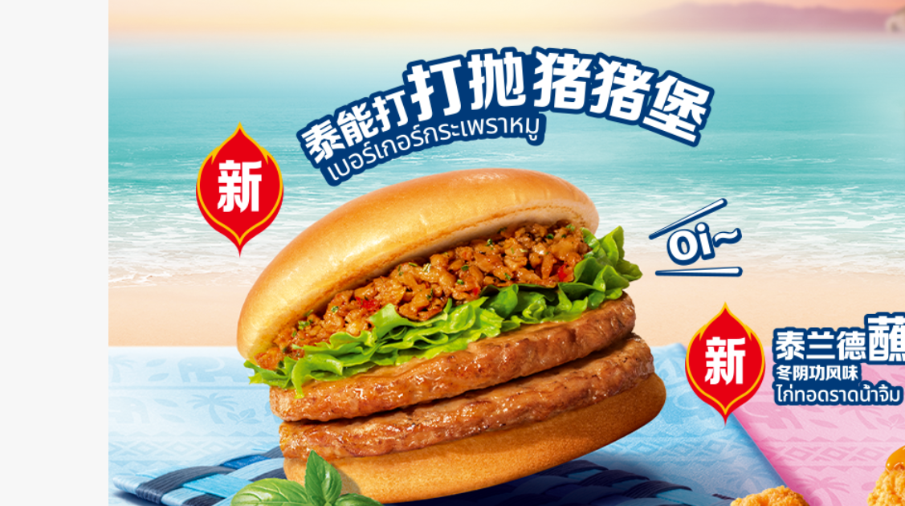
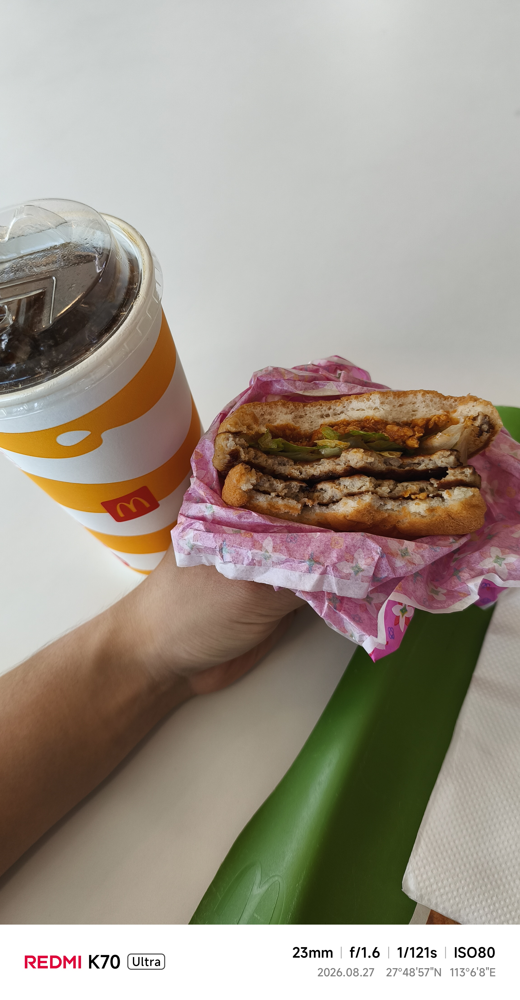

+++
title = '麦当劳'
date = '2026-09-09T22:12:41+08:00'
draft = false

tags = ['美食']
categories = ['探店']

author = 'Luo Hong'

showReadingTime = true
showTableOfContents = true
showWordCount = true
+++
## 新品-泰能打抛猪猪堡
2026.9.2评鉴新品汉堡，美团买卷**单人餐13.9**，包含一份汉堡和大可乐。

### 4.2/5.0 味道不错

- 分量是双吉牛肉包的1.5倍
- 因为顶层加了一些肉沫肉汁，肉应该是烟熏肉，所以汉堡有点烟熏味。
- 有两层猪肉饼打底，口感不错。

汉堡的肉很多，满口肉和微微的烟熏味，整体吃下来相当满足了，味道实打实的过关。不过毕竟是麦当劳，分量偏少，这份套餐只能作为下午茶填填肚子吧。